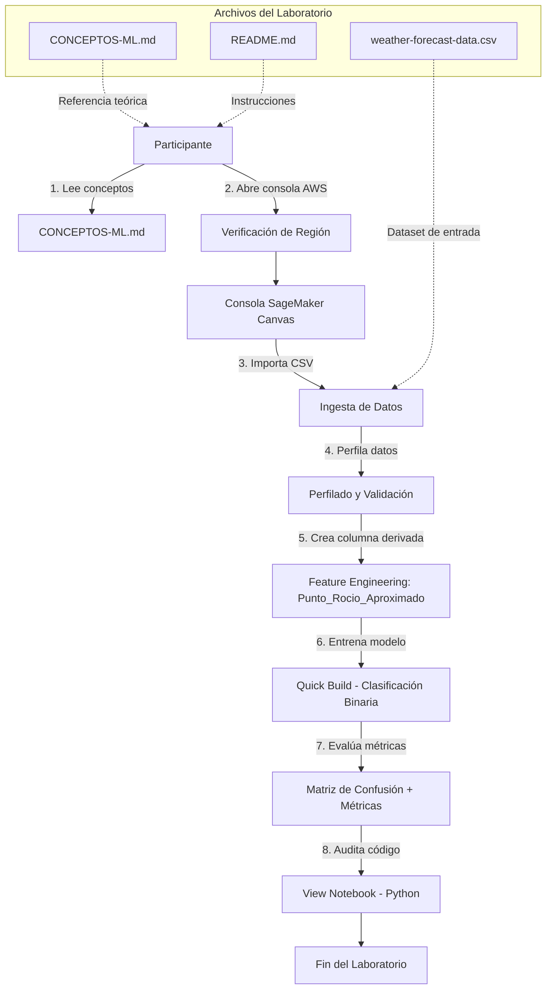
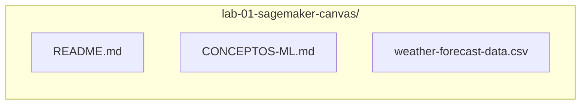
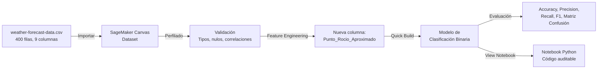

# Documento de Diseño — Lab 01: Machine Learning Low-Code con Amazon SageMaker Canvas

## Visión General

Este diseño describe la estructura, componentes y flujo de trabajo para el Laboratorio 01 de la serie AWS AI Essentials. El laboratorio guía al participante en la construcción de un modelo de clasificación binaria para predecir lluvia utilizando Amazon SageMaker Canvas, un servicio de ML visual sin código.

El laboratorio produce tres entregables principales:

1. **`CONCEPTOS-ML.md`**: Documento de referencia teórica con conceptos fundamentales de Machine Learning, estructurado pedagógicamente de lo básico a lo avanzado.
2. **`README.md`**: Guía paso a paso del laboratorio con diccionario de datos, ingeniería de características, entrenamiento, evaluación y auditoría de código.
3. **`weather-forecast-data.csv`**: Dataset meteorológico de 400 registros con variables climáticas y variable objetivo binaria (`Lluvia`).

El flujo del laboratorio sigue el ciclo de vida de ML: ingesta de datos, perfilado, ingeniería de características (Punto de Rocío Aproximado con fórmula de Magnus), entrenamiento Quick Build, evaluación con matriz de confusión, y auditoría del notebook Python generado.

Duración estimada: 40 minutos.

## Arquitectura

### Diagrama de Flujo del Laboratorio



### Diagrama de Estructura de Archivos



### Flujo de Datos en SageMaker Canvas



## Componentes e Interfaces

### Componente 1: Documento de Conceptos ML (`CONCEPTOS-ML.md`)

**Responsabilidad**: Proveer el marco teórico de Machine Learning necesario para interpretar el laboratorio.

**Estructura interna**:
- Título con emoji único: `📘 Conceptos Fundamentales de Machine Learning`
- Índice con enlaces de ancla a cada sección
- Secciones en orden pedagógico:
  1. Paradigma ML vs. Programación Tradicional
  2. Tipos de Aprendizaje Automático (Supervisado, No Supervisado, Por Refuerzo)
  3. Tipo de Problema: Clasificación Binaria
  4. Roles de los Datos (Target, Features, Dataset)
  5. Ciclo de Vida del ML (Preprocesamiento, Feature Engineering, Entrenamiento, Evaluación)
  6. Parámetros vs. Hiperparámetros
  7. Generalización vs. Sobreajuste (Overfitting)
  8. División de Datos (Train/Validation/Test)
  9. Sesgo de Datos (Bias)
  10. Métricas de Evaluación (Matriz de Confusión, Precision, Recall, Accuracy, F1)
  11. Inferencia
  12. AutoML e Interpretabilidad

**Interfaz con README.md**: El README referencia este documento en prerrequisitos y mediante enlaces contextuales en pasos específicos donde los conceptos son relevantes.

### Componente 2: Guía del Laboratorio (`README.md`)

**Responsabilidad**: Instrucciones paso a paso para ejecutar el laboratorio completo en SageMaker Canvas.

**Estructura interna** (según directrices):
1. Título con emoji único: `🌦️ Laboratorio 1: Machine Learning Low-Code con Amazon SageMaker Canvas`
2. Índice con enlaces de ancla
3. Tiempo estimado: 40 minutos
4. Objetivos de aprendizaje (3-4 puntos)
5. Prerrequisitos (acceso a SageMaker Canvas, dataset, referencia a CONCEPTOS-ML.md)
6. Referencia a CONCEPTOS-ML.md antes de instrucciones
7. Diccionario de datos del dataset meteorológico
8. Contexto de aplicación del pronóstico meteorológico
9. Nota sobre modelo simplificado
10. Instrucciones paso a paso numeradas:
    - Paso 1: Verificación de región AWS
    - Paso 2: Acceso a SageMaker Canvas
    - Paso 3: Importación del dataset
    - Paso 4: Perfilado y validación de datos
    - Paso 5: Feature Engineering (Punto_Rocio_Aproximado)
    - Paso 6: Entrenamiento Quick Build
    - Paso 7: Evaluación del modelo (Matriz de Confusión, métricas)
    - Paso 8: Auditoría de código (View Notebook)
11. Puntos de verificación visual (`✓ Verificación`) después de cada paso mayor
12. Estimaciones de tiempo de espera (`⏱️ Nota`) para operaciones prolongadas
13. Ciclo de vida de recursos
14. Sección de Solución de Problemas (referencia a TROUBLESHOOTING.md)

**Interfaz con archivos de soporte**: Referencia explícita a `weather-forecast-data.csv` por nombre y ruta relativa. Referencia a `CONCEPTOS-ML.md` en prerrequisitos y enlaces contextuales.

### Componente 3: Dataset Meteorológico (`weather-forecast-data.csv`)

**Responsabilidad**: Proveer los datos de entrada para el modelo de clasificación binaria.

**Especificación**:
- Formato: CSV con encabezados
- Registros: exactamente 400 filas de observaciones meteorológicas diarias
- Columnas (9):

| Columna | Tipo | Rango/Formato | Descripción |
|---------|------|---------------|-------------|
| `Fecha` | String | YYYY-MM-DD | Fecha de observación |
| `Mes` | Entero | 1-12 | Mes del año |
| `Temperatura` | Float | ~5-40 °C | Temperatura promedio diaria |
| `Humedad` | Float | 0-100 % | Humedad relativa |
| `Presion_Atmosferica` | Float | ~980-1040 hPa | Presión atmosférica |
| `Velocidad_Viento` | Float | ≥0 km/h | Velocidad promedio del viento |
| `Nubosidad` | Float | 0-100 % | Cobertura nubosa |
| `Precipitacion` | Float | ≥0 mm | Precipitación acumulada |
| `Lluvia` | Entero | 0 o 1 | Variable objetivo (0=No, 1=Sí) |

**Restricciones de calidad**:
- Sin valores nulos en columnas críticas (`Temperatura`, `Humedad`, `Presion_Atmosferica`)
- Correlación estadística verificable entre `Humedad`, `Nubosidad`, `Precipitacion` y `Lluvia`
- Supera el mínimo de 250 filas recomendado por SageMaker Canvas

### Componente 4: Validación con Documentación AWS (Proceso)

**Responsabilidad**: Garantizar que todas las instrucciones, rutas de navegación y configuraciones sean precisas respecto a la versión actual de SageMaker Canvas.

**Proceso**:
- Utilizar el MCP Server de documentación AWS para verificar:
  - Rutas de navegación en la consola de SageMaker Canvas
  - Nombres de botones y opciones de menú
  - Flujos de importación de datos, Feature Engineering, Quick Build y View Notebook
  - Terminología en español consistente con la interfaz de AWS
- Documentar desviaciones con justificación explícita si las hubiera

## Modelos de Datos

### Modelo del Dataset Meteorológico

```
Dataset_Meteorologico {
  Fecha: string           // Formato YYYY-MM-DD
  Mes: integer            // 1-12
  Temperatura: float      // Grados Celsius
  Humedad: float          // Porcentaje 0-100
  Presion_Atmosferica: float  // Hectopascales (hPa)
  Velocidad_Viento: float // km/h
  Nubosidad: float        // Porcentaje 0-100
  Precipitacion: float    // Milímetros (mm)
  Lluvia: integer         // 0 = No llueve, 1 = Llueve
}
```

### Modelo de la Característica Derivada

```
Feature_Engineering {
  entrada: {
    Temperatura: float
    Humedad: float
  }
  formula: "Temperatura - ((100 - Humedad) / 5)"
  salida: {
    Punto_Rocio_Aproximado: float  // Grados Celsius
  }
  base_cientifica: "Aproximación de Magnus para punto de rocío"
}
```

### Modelo de Evaluación del Modelo

```
Evaluacion_Modelo {
  Matriz_Confusion: {
    Verdadero_Positivo: integer   // Predijo lluvia, llovió
    Verdadero_Negativo: integer   // Predijo no lluvia, no llovió
    Falso_Positivo: integer       // Predijo lluvia, no llovió
    Falso_Negativo: integer       // Predijo no lluvia, llovió
  }
  Metricas: {
    Accuracy: float               // (VP + VN) / Total
    Precision: float              // VP / (VP + FP)
    Recall: float                 // VP / (VP + FN)
    F1_Score: float               // 2 * (Precision * Recall) / (Precision + Recall)
  }
  Feature_Importance: Map<string, float>  // Variable -> peso porcentual
}
```

### Modelo de Estructura de Documentos

```
Estructura_Laboratorio {
  carpeta: "lab-01-sagemaker-canvas/"
  archivos: {
    "README.md": Guia_Laboratorio
    "CONCEPTOS-ML.md": Guia_Conceptos_ML
    "weather-forecast-data.csv": Dataset_Meteorologico
  }
}

Guia_Laboratorio {
  titulo: string              // Con emoji único al inicio
  indice: Seccion[]           // Con enlaces de ancla
  tiempo_estimado: "40 minutos"
  objetivos: string[]         // 3-4 objetivos
  prerrequisitos: string[]
  referencia_conceptos: enlace a CONCEPTOS-ML.md
  diccionario_datos: Columna[]
  contexto_aplicacion: string
  nota_modelo_simplificado: string
  pasos: Paso[]               // Numerados secuencialmente
  verificaciones: Verificacion[]
  ciclo_vida_recursos: string
  solucion_problemas: enlace a TROUBLESHOOTING.md
}

Guia_Conceptos_ML {
  titulo: string              // Con emoji único al inicio
  indice: Seccion[]           // Con enlaces de ancla
  secciones: Seccion[]        // Orden pedagógico
}
```

## Propiedades de Correctitud

*Una propiedad es una característica o comportamiento que debe mantenerse verdadero en todas las ejecuciones válidas de un sistema — esencialmente, una declaración formal sobre lo que el sistema debe hacer. Las propiedades sirven como puente entre las especificaciones legibles por humanos y las garantías de correctitud verificables por máquina.*

### Propiedad 1: Estructura válida de CONCEPTOS-ML.md

*Para cualquier* documento CONCEPTOS-ML.md generado, este debe contener: exactamente un emoji al inicio del título, un índice con enlaces de ancla donde cada enlace apunte a una sección existente en el documento, y las secciones deben estar ordenadas pedagógicamente (paradigma ML, tipos de aprendizaje, clasificación binaria, roles de datos, ciclo de vida ML, parámetros vs hiperparámetros, generalización, división de datos, sesgo, métricas, inferencia, AutoML).

**Validates: Requirements 1.1**

### Propiedad 2: Estructura válida del README del laboratorio

*Para cualquier* README de laboratorio generado, este debe contener: exactamente un emoji al inicio del título, un índice con enlaces de ancla donde cada enlace apunte a una sección existente, el tiempo estimado de finalización, y una lista de objetivos de aprendizaje.

**Validates: Requirements 8.2, 8.9**

### Propiedad 3: Invariante de cantidad de registros del dataset

*Para cualquier* archivo `weather-forecast-data.csv` generado, el número de filas de datos (excluyendo el encabezado) debe ser exactamente 400.

**Validates: Requirements 2.4**

### Propiedad 4: Ausencia de valores nulos en columnas críticas del dataset

*Para cualquier* fila del dataset `weather-forecast-data.csv`, las columnas `Temperatura`, `Humedad` y `Presion_Atmosferica` no deben contener valores nulos ni vacíos.

**Validates: Requirements 3.2**

### Propiedad 5: Validez estadística del dataset — correlación con variable objetivo

*Para cualquier* dataset meteorológico generado, debe existir una correlación estadística positiva entre las variables `Humedad`, `Nubosidad`, `Precipitacion` y la variable objetivo `Lluvia`, confirmando la viabilidad técnica del modelo de clasificación.

**Validates: Requirements 3.3**

### Propiedad 6: Correctitud de la fórmula del Punto de Rocío Aproximado

*Para cualquier* par válido de valores (Temperatura, Humedad) donde Temperatura es un float y Humedad es un porcentaje entre 0 y 100, el cálculo `Temperatura - ((100 - Humedad) / 5)` debe producir el valor correcto de Punto_Rocio_Aproximado, y este valor debe ser menor o igual a la Temperatura original.

**Validates: Requirements 4.2**

### Propiedad 7: Primer paso del README es verificación de región

*Para cualquier* README de laboratorio generado, el primer paso numerado de las instrucciones debe ser la verificación de la región de AWS en la esquina superior derecha de la consola.

**Validates: Requirements 8.1**

### Propiedad 8: Referencias cruzadas a CONCEPTOS-ML.md presentes en README

*Para cualquier* README de laboratorio generado, debe contener al menos una referencia a `CONCEPTOS-ML.md` en la sección de prerrequisitos y al menos un enlace contextual a una sección específica de CONCEPTOS-ML.md dentro de las instrucciones paso a paso.

**Validates: Requirements 1.15, 8.11**

### Propiedad 9: Placeholder de participante en nombrado de recursos

*Para cualquier* ejemplo de nombrado de recursos AWS en el README del laboratorio, el nombre debe contener el placeholder `{nombre-participante}`.

**Validates: Requirements 8.6**

### Propiedad 10: Puntos de verificación visual después de pasos mayores

*Para cualquier* paso del README que involucre creación o configuración de recursos (importación de datos, creación de columna derivada, entrenamiento de modelo), debe existir un punto de verificación visual (`✓ Verificación`) inmediatamente después del paso.

**Validates: Requirements 8.7**

## Manejo de Errores

### Errores durante la ejecución del laboratorio

| Escenario | Causa | Manejo |
|-----------|-------|--------|
| Error de permisos IAM al acceder a SageMaker Canvas | Rol IAM insuficiente o no asignado | Notificar al instructor inmediatamente. No intentar solucionar por cuenta propia. |
| Error de límite de cuota AWS | Cuota de servicio excedida en la cuenta compartida | Notificar al instructor. No crear recursos alternativos. |
| Fallo en importación del CSV | Formato incorrecto, encoding, o archivo corrupto | Verificar que el archivo es el proporcionado sin modificaciones. Re-descargar del repositorio si es necesario. |
| SageMaker Canvas no reconoce tipos de datos | Columnas con formato inesperado | Verificar que el CSV no fue editado. Confirmar que los separadores son comas y el encoding es UTF-8. |
| Quick Build falla o no inicia | Recursos insuficientes o timeout de sesión | Refrescar la página, verificar que la sesión no expiró. Si persiste, notificar al instructor. |
| View Notebook no disponible | Modelo no completó entrenamiento o funcionalidad deshabilitada | Verificar que el modelo terminó de entrenar. Esperar a que el estado sea "Ready". |
| Fórmula de Punto_Rocio_Aproximado produce error | Valores nulos o tipos incorrectos en Temperatura/Humedad | Verificar en el perfilado que no hay valores nulos. Confirmar tipos numéricos. |

### Errores en la generación de documentación

| Escenario | Causa | Manejo |
|-----------|-------|--------|
| Dataset con menos de 400 filas | Error en generación del CSV | Regenerar el dataset asegurando exactamente 400 filas. |
| Enlaces de ancla rotos en índice | Desincronización entre TOC y secciones | Validar que cada enlace del índice tiene su sección correspondiente. |
| Terminología inconsistente con AWS | Cambios en la interfaz de AWS | Validar con MCP Server de documentación AWS y actualizar. |
| Falta referencia a CONCEPTOS-ML.md | Omisión en generación del README | Verificar presencia de enlaces en prerrequisitos y pasos contextuales. |

## Estrategia de Pruebas

### Enfoque Dual de Pruebas

Este laboratorio requiere dos tipos complementarios de pruebas:

1. **Pruebas unitarias (ejemplos específicos)**: Verifican casos concretos, presencia de contenido y condiciones de borde.
2. **Pruebas basadas en propiedades (property-based testing)**: Verifican propiedades universales que deben cumplirse para todas las entradas válidas.

### Pruebas Basadas en Propiedades

**Librería**: `fast-check` (JavaScript/TypeScript) — seleccionada por su madurez, soporte de generadores personalizados y compatibilidad con el ecosistema Node.js.

**Configuración**: Mínimo 100 iteraciones por prueba de propiedad.

**Etiquetado**: Cada prueba debe incluir un comentario con el formato:
`// Feature: lab-01-sagemaker-canvas, Property {N}: {descripción}`

**Cada propiedad de correctitud debe ser implementada por UNA SOLA prueba basada en propiedades.**

#### Pruebas de Propiedad a Implementar

| Propiedad | Descripción | Generador |
|-----------|-------------|-----------|
| P1 | Estructura CONCEPTOS-ML.md | Generar documentos markdown con secciones aleatorias y validar estructura |
| P2 | Estructura README | Generar documentos README con componentes aleatorios y validar estructura |
| P3 | 400 filas en dataset | Generar datasets CSV con número variable de filas y validar conteo |
| P4 | Sin nulos en columnas críticas | Generar filas con valores aleatorios (incluyendo nulos) y validar rechazo |
| P5 | Correlación estadística | Generar datasets con distribuciones aleatorias y validar correlación |
| P6 | Fórmula Punto de Rocío | Generar pares (Temperatura, Humedad) aleatorios y validar cálculo |
| P7 | Primer paso es verificación de región | Generar READMEs con pasos en orden aleatorio y validar primer paso |
| P8 | Referencias cruzadas a CONCEPTOS-ML.md | Generar READMEs y validar presencia de enlaces |
| P9 | Placeholder {nombre-participante} | Generar ejemplos de nombres de recursos y validar placeholder |
| P10 | Verificaciones visuales post-paso | Generar secuencias de pasos y validar checkpoints |

### Pruebas Unitarias (Ejemplos y Casos de Borde)

Las pruebas unitarias cubren los criterios de aceptación marcados como "example" y "edge-case":

| Criterio | Prueba | Tipo |
|----------|--------|------|
| 1.2-1.13 | Verificar que CONCEPTOS-ML.md contiene cada sección requerida (paradigma ML, tipos de aprendizaje, clasificación binaria, roles de datos, ciclo de vida, parámetros vs hiperparámetros, generalización, división de datos, sesgo, métricas, inferencia, AutoML) | Ejemplo |
| 2.1 | Verificar que el diccionario de datos documenta las 9 columnas del CSV | Ejemplo |
| 2.2 | Verificar presencia de contexto de aplicación (agricultura, desastres, aviación, recursos hídricos) | Ejemplo |
| 2.3 | Verificar presencia de nota sobre modelo simplificado | Ejemplo |
| 4.3 | Verificar explicación del sustento meteorológico del punto de rocío | Ejemplo |
| 5.2 | Verificar que el README guía la interpretación de Falsos Negativos en la matriz de confusión | Ejemplo |
| 5.3 | Verificar que el README indica verificar el peso del Punto_Rocio_Aproximado | Ejemplo |
| 6.2 | Verificar que el README indica localizar código Pandas de la fórmula en el notebook | Ejemplo |
| 8.3 | Verificar sección de Solución de Problemas con enlace a TROUBLESHOOTING.md | Ejemplo |
| 8.4 | Verificar especificación del ciclo de vida de recursos | Ejemplo |
| 8.5 | Verificar referencia explícita a `weather-forecast-data.csv` | Ejemplo |
| 8.8 | Verificar estimaciones de tiempo de espera para Quick Build | Ejemplo |
| 8.10 | Verificar sección de prerrequisitos | Ejemplo |
| 4.2 (borde) | Fórmula con Humedad = 0 produce `Temperatura - 20` | Caso de borde |
| 4.2 (borde) | Fórmula con Humedad = 100 produce `Temperatura` (punto de rocío = temperatura) | Caso de borde |
| 3.2 (borde) | Dataset con una fila que tiene valor nulo en Temperatura debe ser rechazado | Caso de borde |
