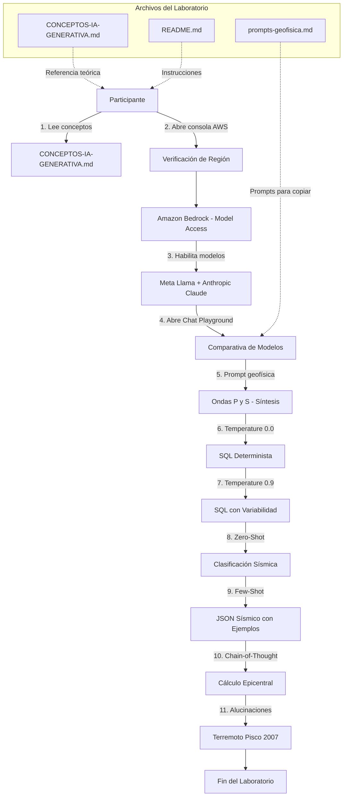
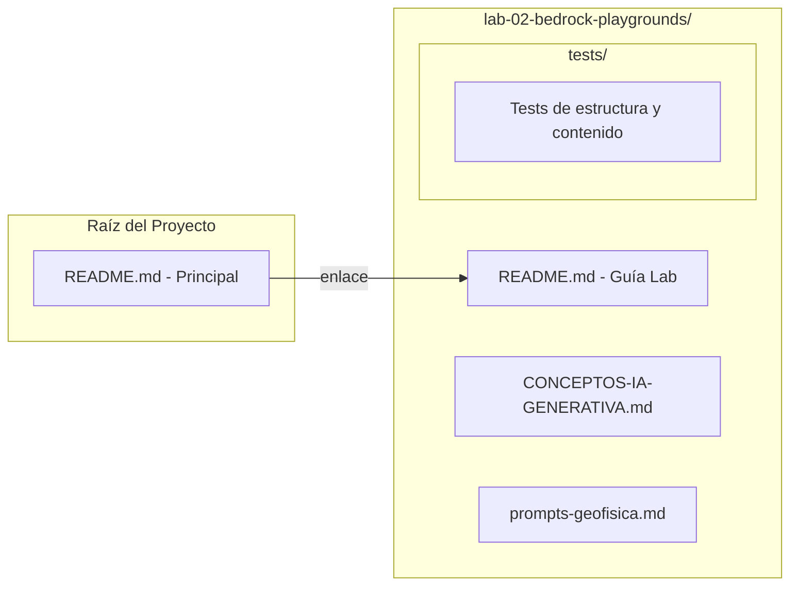
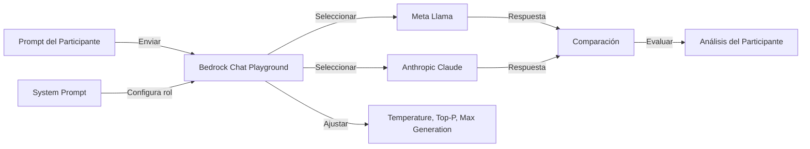

# Documento de Diseño — Lab 02: IA Generativa con Amazon Bedrock Playgrounds

## Visión General

Este diseño describe la estructura, componentes y flujo de trabajo para el Laboratorio 02 de la serie AWS AI Essentials. El laboratorio guía al participante en la exploración y comparación de Modelos Fundacionales (FMs) disponibles en Amazon Bedrock Playgrounds, aplicando técnicas de prompting progresivamente más sofisticadas (Zero-Shot, Few-Shot, Chain-of-Thought) con ejemplos contextualizados en geofísica y sismología.

El laboratorio produce cuatro entregables principales:

1. **`CONCEPTOS-IA-GENERATIVA.md`**: Documento de referencia teórica con 14 secciones pedagógicas sobre IA Generativa, desde definiciones básicas hasta conceptos avanzados como embeddings y multimodalidad.
2. **`README.md`**: Guía paso a paso del laboratorio con comparativa de modelos, técnicas de prompting, gestión de parámetros de inferencia y exploración de alucinaciones.
3. **`prompts-geofisica.md`**: Archivo de soporte con todos los prompts de ejemplo para copiar/pegar directamente en Amazon Bedrock Playgrounds.
4. **`README.md` (raíz)**: README principal del proyecto con la tabla de los 5 laboratorios de la serie AWS AI Essentials.

A diferencia del Lab 01 (SageMaker Canvas) que trabaja con ML tradicional y datasets propios, el Lab 02 utiliza modelos preentrenados de propósito general accesibles a través de Amazon Bedrock, sin necesidad de datos de entrenamiento ni infraestructura dedicada.

Duración estimada: 40 minutos.

## Arquitectura

### Diagrama de Flujo del Laboratorio



### Diagrama de Estructura de Archivos



### Flujo de Interacción con Amazon Bedrock



## Componentes e Interfaces

### Componente 1: Guía de Conceptos de IA Generativa (`CONCEPTOS-IA-GENERATIVA.md`)

**Responsabilidad**: Proveer el marco teórico de IA Generativa necesario para interpretar el laboratorio, con 14 secciones pedagógicas organizadas de lo básico a lo avanzado.

**Estructura interna**:
- Título con emoji único: `🧠 Conceptos Fundamentales de IA Generativa`
- Índice con enlaces de ancla a cada sección
- Secciones en orden pedagógico:
  1. Qué es la IA Generativa (definición, distinción con ML tradicional)
  2. Conceptos Arquitectónicos (FM, LLM, Context Window, Inferencia)
  3. Predicción de Siguiente Token (mecanismo interno, distribución de probabilidad)
  4. Prompt y System Prompt (definiciones, diferencia clave)
  5. Familias de Modelos en Amazon Bedrock (Anthropic Claude, Meta Llama, criterios de selección)
  6. Unidades y Métricas (Token, Latencia vs. Throughput)
  7. Parámetros de Inferencia (Temperature, Top-P, Max Generation)
  8. Estrategias de Prompting (Zero-Shot, Few-Shot, Chain-of-Thought)
  9. Seguridad y Riesgos (Alucinaciones, Prompt Injection, PII)
  10. IA Generativa vs. ML Tradicional (comparativa con Lab 01)
  11. Embeddings y Multimodalidad (conceptos avanzados)
  12. Terminología AWS (consistencia con documentación oficial)

- Formato consistente con `CONCEPTOS-ML.md` del Lab 01 (separadores `---`, bloques de código, tablas cuando aplique)
- Terminología validada contra documentación oficial de AWS

**Interfaz con README.md**: El README referencia este documento en prerrequisitos y mediante enlaces contextuales en pasos específicos donde los conceptos son relevantes (ej. al ajustar Temperature, enlazar a la sección de Parámetros de Inferencia).

### Componente 2: Guía del Laboratorio (`README.md`)

**Responsabilidad**: Instrucciones paso a paso para ejecutar el laboratorio completo en Amazon Bedrock Playgrounds.

**Estructura interna** (según directrices):
1. Título con emoji único: `🔬 Laboratorio 2: IA Generativa con Amazon Bedrock Playgrounds`
2. Índice con enlaces de ancla
3. Tiempo estimado: 40 minutos
4. Objetivos de aprendizaje (3-4 puntos)
5. Prerrequisitos (acceso a Amazon Bedrock, modelos habilitados, referencia a CONCEPTOS-IA-GENERATIVA.md)
6. Referencia a CONCEPTOS-IA-GENERATIVA.md antes de instrucciones
7. Instrucciones paso a paso numeradas:
   - Paso 1: Verificación de región AWS
   - Paso 2: Acceso a Amazon Bedrock y habilitación de modelos (Model Access)
   - Paso 3: Comparativa de modelos (Meta Llama vs Anthropic Claude) con prompt de ondas sísmicas P y S
   - Paso 4: Impacto de Temperature (0.0 vs 0.9) con prompt SQL de eventos sísmicos
   - Paso 5: Técnica Zero-Shot (clasificación de reporte sísmico)
   - Paso 6: Técnica Few-Shot (clasificación JSON con 3 ejemplos sísmicos)
   - Paso 7: Técnica Chain-of-Thought (cálculo de distancia epicentral)
   - Paso 8: Exploración de alucinaciones (terremoto de Pisco 2007)
   - Paso 9: Gestión de parámetros de inferencia y costos
8. Tabla comparativa de técnicas de prompting
9. Sección de análisis comparativo de modelos
10. Puntos de verificación visual (`✓ Verificación`) después de cada paso mayor
11. Ciclo de vida de recursos (nota sobre costos por tokens, sin recursos persistentes)
12. Sección de Solución de Problemas (referencia a TROUBLESHOOTING.md)

**Interfaz con archivos de soporte**: Referencia explícita a `prompts-geofisica.md` por nombre y ruta relativa. Referencia a `CONCEPTOS-IA-GENERATIVA.md` en prerrequisitos y enlaces contextuales.

### Componente 3: Archivo de Prompts de Geofísica (`prompts-geofisica.md`)

**Responsabilidad**: Proveer todos los prompts de ejemplo del laboratorio en un formato fácil de copiar/pegar, evitando que el participante deba transcribirlos manualmente desde el README.

**Estructura interna**:
- Título descriptivo
- Secciones organizadas por técnica de prompting:
  - Prompt de comparación de modelos (ondas P y S)
  - Prompt SQL de eventos sísmicos (para Temperature 0.0 y 0.9)
  - System prompt de geofísico experto
  - Prompt Zero-Shot (clasificación de reporte sísmico)
  - Prompt Few-Shot (3 ejemplos JSON + caso a clasificar)
  - Prompt Chain-of-Thought (cálculo de distancia epicentral)
  - Prompt de alucinaciones (terremoto de Pisco 2007)
- Cada prompt en bloque de código para facilitar la copia

**Interfaz con README.md**: El README referencia este archivo en cada paso donde se utiliza un prompt, indicando: "Copie el prompt del archivo `prompts-geofisica.md` ubicado en esta carpeta".

### Componente 4: README Principal del Proyecto (`README.md` en raíz)

**Responsabilidad**: Proveer la visión general del programa AWS AI Essentials con la tabla de los 5 laboratorios.

**Estructura interna** (según directrices):
1. Título: `☁️ AWS AI Essentials`
2. Descripción general del programa
3. Resumen de objetivos de aprendizaje
4. Prerrequisitos generales
5. Tabla de laboratorios:
   | Lab | Título | Descripción | Tiempo |
   |-----|--------|-------------|--------|
   | 01 | ML No-Code con SageMaker Canvas | ... | 40 min |
   | 02 | IA Generativa con Bedrock Playgrounds | ... | 40 min |
   | 03 | Próximamente | ... | - |
   | 04 | Próximamente | ... | - |
   | 05 | Próximamente | ... | - |
6. Contenido adicional (AWS Documentation, Skill Builder, Certification)
7. Contribuciones
8. Licencia MIT: "Este proyecto está licenciado bajo la Licencia MIT. Copyright © 2026 AMBER CLOUD GLOBAL LLC"

### Componente 5: Validación con Documentación AWS (Proceso)

**Responsabilidad**: Garantizar que todas las instrucciones, rutas de navegación y configuraciones sean precisas respecto a la versión actual de Amazon Bedrock.

**Proceso**:
- Utilizar el MCP Server de documentación AWS para verificar:
  - Rutas de navegación en la consola de Amazon Bedrock
  - Nombres de modelos disponibles (Meta Llama, Anthropic Claude)
  - Disponibilidad regional de modelos
  - Rangos de parámetros (Temperature, Top-P, Max Generation)
  - Flujo de habilitación de modelos (Model Access)
  - Terminología en español consistente con la interfaz de AWS
- Documentar desviaciones con justificación explícita si las hubiera

### Componente 6: Suite de Tests (`tests/`)

**Responsabilidad**: Verificar la estructura y contenido de los documentos del laboratorio mediante pruebas automatizadas.

**Estructura**:
- `tests/conceptos-ia-generativa-content.test.ts`: Tests unitarios de contenido de las 14 secciones
- `tests/conceptos-ia-generativa-structure.property.test.ts`: Tests de propiedad para estructura del documento
- `tests/readme-content.test.ts`: Tests unitarios de contenido del README del laboratorio
- `tests/readme-structure.property.test.ts`: Tests de propiedad para estructura del README
- `tests/prompts-geofisica-content.test.ts`: Tests de contenido del archivo de prompts
- `tests/readme-principal.test.ts`: Tests de contenido del README principal

**Tecnología**: Vitest + fast-check (misma stack que Lab 01)

## Modelos de Datos

### Modelo de Estructura de Documentos

```
Estructura_Laboratorio_02 {
  carpeta: "lab-02-bedrock-playgrounds/"
  archivos: {
    "README.md": Guia_Laboratorio
    "CONCEPTOS-IA-GENERATIVA.md": Guia_Conceptos_IA_Generativa
    "prompts-geofisica.md": Archivo_Prompts
    "tests/": Suite_Tests
    "package.json": Configuracion_Tests
    "vitest.config.ts": Configuracion_Vitest
    "tsconfig.json": Configuracion_TypeScript
  }
}

Estructura_Raiz {
  "README.md": README_Principal
}
```

### Modelo de la Guía de Conceptos

```
Guia_Conceptos_IA_Generativa {
  titulo: string              // Con emoji único al inicio (🧠)
  indice: Seccion[]           // Con enlaces de ancla
  secciones: [
    IA_Generativa_Definicion,
    Conceptos_Arquitectonicos,
    Prediccion_Siguiente_Token,
    Prompt_Y_System_Prompt,
    Familias_Modelos_Bedrock,
    Unidades_Y_Metricas,
    Parametros_Inferencia,
    Estrategias_Prompting,
    Seguridad_Y_Riesgos,
    IA_Gen_vs_ML_Tradicional,
    Embeddings_Y_Multimodalidad,
    Terminologia_AWS
  ]
}
```

### Modelo de Prompts de Geofísica

```
Archivo_Prompts {
  prompt_comparacion: string       // Ondas P y S para estudiante de 15 años
  prompt_sql: string               // SELECT TOP 5 eventos sísmicos
  system_prompt: string            // Rol de geofísico experto
  prompt_zero_shot: string         // Clasificación de reporte sísmico
  prompt_few_shot: {
    ejemplos: Ejemplo_JSON[3]      // 3 ejemplos de clasificación sísmica
    caso_clasificar: string        // Caso nuevo a clasificar
  }
  prompt_chain_of_thought: string  // Cálculo distancia epicentral (ondas P 6km/s, S 3.5km/s)
  prompt_alucinaciones: string     // Terremoto Pisco 2007
}

Ejemplo_JSON {
  reporte: string
  clasificacion: "Sismo_Tectonico" | "Sismo_Volcanico" | "Sismo_Inducido"
  nivel_alerta: "Moderado" | "Vigilancia" | "Monitoreo"
}
```

### Modelo del README Principal

```
README_Principal {
  titulo: "☁️ AWS AI Essentials"
  descripcion: string
  objetivos: string[]
  prerrequisitos: string[]
  tabla_laboratorios: Laboratorio[5]
  contenido_adicional: Seccion[]
  contribuciones: string
  licencia: "MIT - Copyright © 2026 AMBER CLOUD GLOBAL LLC"
}

Laboratorio {
  numero: integer              // 01-05
  titulo: string
  descripcion: string
  tiempo_estimado: string      // "40 min" o "Próximamente"
  enlace: string               // Ruta relativa a carpeta del lab
  estado: "Completado" | "Próximamente"
}
```

### Modelo de Parámetros de Inferencia

```
Parametros_Inferencia {
  Temperature: {
    rango: [0.0, 1.0]
    uso_bajo: "Código SQL, cálculos, reportes técnicos"
    uso_alto: "Narrativas, contenido educativo, creatividad"
  }
  Top_P: {
    rango: [0.0, 1.0]
    descripcion: "Nucleus Sampling - subconjunto acumulativo"
  }
  Max_Generation: {
    rango: [1, 4096+]         // Varía según modelo
    uso_bajo: "Clasificaciones, respuestas cortas"
    uso_alto: "Análisis detallados, Chain-of-Thought"
  }
}
```

### Modelo de Técnicas de Prompting

```
Tecnica_Prompting {
  nombre: "Zero-Shot" | "Few-Shot" | "Chain-of-Thought"
  cuando_usar: string
  ventaja_principal: string
  limitacion_principal: string
  ejemplo_geofisica: string
}
```


## Propiedades de Correctitud

*Una propiedad es una característica o comportamiento que debe mantenerse verdadero en todas las ejecuciones válidas de un sistema — esencialmente, una declaración formal sobre lo que el sistema debe hacer. Las propiedades sirven como puente entre las especificaciones legibles por humanos y las garantías de correctitud verificables por máquina.*

### Propiedad 1: Estructura válida de CONCEPTOS-IA-GENERATIVA.md

*Para cualquier* documento CONCEPTOS-IA-GENERATIVA.md generado, este debe contener: exactamente un emoji al inicio del título, un índice con enlaces de ancla donde cada enlace apunte a una sección existente en el documento, y las secciones deben estar en orden pedagógico (IA Generativa, conceptos arquitectónicos, predicción de siguiente token, prompt y system prompt, familias de modelos, unidades y métricas, parámetros de inferencia, estrategias de prompting, seguridad y riesgos, IA generativa vs ML tradicional, embeddings y multimodalidad, terminología AWS).

**Validates: Requirements 1.1**

### Propiedad 2: Estructura válida del README del laboratorio

*Para cualquier* README de laboratorio generado, este debe contener: exactamente un emoji al inicio del título, un índice con enlaces de ancla donde cada enlace apunte a una sección existente, el tiempo estimado de finalización, y una lista de objetivos de aprendizaje.

**Validates: Requirements 8.2, 8.7**

### Propiedad 3: Primer paso del README es verificación de región

*Para cualquier* README de laboratorio generado, el primer paso numerado de las instrucciones debe ser la verificación de la región de AWS en la esquina superior derecha de la consola.

**Validates: Requirements 8.1**

### Propiedad 4: Referencias cruzadas a CONCEPTOS-IA-GENERATIVA.md presentes en README

*Para cualquier* README de laboratorio generado, debe contener al menos una referencia a `CONCEPTOS-IA-GENERATIVA.md` en la sección de prerrequisitos y al menos un enlace contextual a una sección específica de CONCEPTOS-IA-GENERATIVA.md dentro de las instrucciones paso a paso.

**Validates: Requirements 1.14, 8.9**

### Propiedad 5: Puntos de verificación visual después de pasos mayores

*Para cualquier* paso del README que involucre configuración o experimentación en Amazon Bedrock (selección de modelos, ajuste de parámetros, envío de prompts), debe existir un punto de verificación visual (`✓ Verificación`) inmediatamente después del paso.

**Validates: Requirements 8.6**

### Propiedad 6: Estructura válida del README Principal

*Para cualquier* README principal generado, este debe contener: exactamente un emoji al inicio del título, una tabla con exactamente 5 entradas de laboratorios, enlaces funcionales a las carpetas de laboratorios completados, y el texto de licencia MIT con "Copyright © 2026 AMBER CLOUD GLOBAL LLC".

**Validates: Requirements 7.1**

## Manejo de Errores

### Errores durante la ejecución del laboratorio

| Escenario | Causa | Manejo |
|-----------|-------|--------|
| Error de permisos al acceder a Amazon Bedrock | Rol IAM insuficiente o políticas restrictivas | Notificar al instructor inmediatamente. No intentar solucionar por cuenta propia. |
| Modelos no disponibles en Model Access | Modelos no habilitados o región sin soporte | Verificar que el instructor habilitó los modelos. Confirmar la región correcta. |
| Error de límite de cuota AWS | Cuota de servicio excedida en la cuenta compartida | Notificar al instructor. No crear recursos alternativos. |
| Modelo no responde o timeout | Carga del servicio o prompt excesivamente largo | Reducir la longitud del prompt. Esperar unos segundos y reintentar. |
| Respuesta truncada del modelo | Max Generation configurado demasiado bajo | Aumentar el valor de Max Generation en los parámetros de inferencia. |
| Chat Playground no carga | Problema de conectividad o sesión expirada | Refrescar la página. Verificar que la sesión de AWS no expiró. |
| Modelo genera respuesta en idioma incorrecto | System prompt no configurado o modelo no soporta español | Verificar que el system prompt está configurado. Algunos modelos responden mejor en inglés. |
| Comparación de modelos no disponible | Funcionalidad no habilitada en la región | Verificar disponibilidad regional. Usar dos pestañas separadas como alternativa. |

### Errores en la generación de documentación

| Escenario | Causa | Manejo |
|-----------|-------|--------|
| Enlaces de ancla rotos en índice | Desincronización entre TOC y secciones | Validar que cada enlace del índice tiene su sección correspondiente. |
| Terminología inconsistente con AWS | Cambios en la interfaz de AWS | Validar con MCP Server de documentación AWS y actualizar. |
| Falta referencia a CONCEPTOS-IA-GENERATIVA.md | Omisión en generación del README | Verificar presencia de enlaces en prerrequisitos y pasos contextuales. |
| Prompts no coinciden entre README y prompts-geofisica.md | Edición parcial de uno de los archivos | Mantener prompts-geofisica.md como fuente de verdad y referenciar desde README. |
| README Principal sin tabla completa | Omisión de laboratorios en la tabla | Verificar que la tabla contiene exactamente 5 entradas (Lab 01-05). |

## Estrategia de Pruebas

### Enfoque Dual de Pruebas

Este laboratorio requiere dos tipos complementarios de pruebas:

1. **Pruebas unitarias (ejemplos específicos)**: Verifican casos concretos, presencia de contenido y condiciones de borde.
2. **Pruebas basadas en propiedades (property-based testing)**: Verifican propiedades universales que deben cumplirse para todas las entradas válidas.

### Pruebas Basadas en Propiedades

**Librería**: `fast-check` (JavaScript/TypeScript) — misma stack que Lab 01, seleccionada por su madurez, soporte de generadores personalizados y compatibilidad con Vitest.

**Configuración**: Mínimo 100 iteraciones por prueba de propiedad.

**Etiquetado**: Cada prueba debe incluir un comentario con el formato:
`// Feature: lab-02-bedrock-playgrounds, Property {N}: {descripción}`

**Cada propiedad de correctitud debe ser implementada por UNA SOLA prueba basada en propiedades.**

#### Pruebas de Propiedad a Implementar

| Propiedad | Archivo de Test | Descripción |
|-----------|----------------|-------------|
| P1 | `conceptos-ia-generativa-structure.property.test.ts` | Validar estructura de CONCEPTOS-IA-GENERATIVA.md: emoji en título, índice con anclas válidas, 12 secciones en orden pedagógico |
| P2 | `readme-structure.property.test.ts` | Validar estructura del README: emoji en título, índice con anclas válidas, tiempo estimado, objetivos de aprendizaje |
| P3 | `readme-structure.property.test.ts` | Validar que el primer paso numerado es verificación de región AWS |
| P4 | `readme-structure.property.test.ts` | Validar referencias cruzadas a CONCEPTOS-IA-GENERATIVA.md en prerrequisitos y pasos |
| P5 | `readme-structure.property.test.ts` | Validar presencia de checkpoints `✓ Verificación` después de pasos de configuración |
| P6 | `readme-principal.property.test.ts` | Validar estructura del README Principal: emoji, tabla con 5 labs, licencia MIT |

### Pruebas Unitarias (Ejemplos y Casos de Borde)

Las pruebas unitarias cubren los criterios de aceptación marcados como "example":

| Criterio | Archivo de Test | Prueba | Tipo |
|----------|----------------|--------|------|
| 1.2 | `conceptos-ia-generativa-content.test.ts` | Sección IA Generativa: contiene definición, distinción con ML, nota sobre generación estadística | Ejemplo |
| 1.3 | `conceptos-ia-generativa-content.test.ts` | Sección Conceptos Arquitectónicos: contiene FM, LLM, Context Window, Inferencia | Ejemplo |
| 1.4 | `conceptos-ia-generativa-content.test.ts` | Sección Predicción Siguiente Token: contiene distribución de probabilidad, Temperature | Ejemplo |
| 1.5 | `conceptos-ia-generativa-content.test.ts` | Sección Prompt y System Prompt: contiene definiciones y diferencia clave | Ejemplo |
| 1.6 | `conceptos-ia-generativa-content.test.ts` | Sección Familias de Modelos: contiene Anthropic Claude, Meta Llama, Amazon Bedrock | Ejemplo |
| 1.7 | `conceptos-ia-generativa-content.test.ts` | Sección Unidades y Métricas: contiene Token, Latencia, Throughput | Ejemplo |
| 1.8 | `conceptos-ia-generativa-content.test.ts` | Sección Parámetros de Inferencia: contiene Temperature, Top-P, Max Generation | Ejemplo |
| 1.9 | `conceptos-ia-generativa-content.test.ts` | Sección Estrategias de Prompting: contiene Zero-Shot, Few-Shot, Chain-of-Thought | Ejemplo |
| 1.10 | `conceptos-ia-generativa-content.test.ts` | Sección Seguridad y Riesgos: contiene Alucinación, Prompt Injection, PII | Ejemplo |
| 1.11 | `conceptos-ia-generativa-content.test.ts` | Sección IA Gen vs ML Tradicional: contiene ML Tradicional, Lab 01, SageMaker Canvas | Ejemplo |
| 1.12 | `conceptos-ia-generativa-content.test.ts` | Sección Embeddings y Multimodalidad: contiene Embedding, vector, Multimodalidad | Ejemplo |
| 2.1-2.5 | `readme-content.test.ts` | Comparativa de modelos: selección de modelos, prompt ondas P y S, Temperature 0.0 y 0.9, análisis comparativo | Ejemplo |
| 3.1 | `readme-content.test.ts` | Prompt Zero-Shot de clasificación sísmica presente | Ejemplo |
| 3.2 | `readme-content.test.ts` | Prompt Few-Shot con 3 ejemplos JSON (Sismo_Tectonico, Sismo_Volcanico, Sismo_Inducido) | Ejemplo |
| 3.3 | `readme-content.test.ts` | Prompt Chain-of-Thought con cálculo epicentral (ondas P 6 km/s, S 3.5 km/s) | Ejemplo |
| 3.4 | `readme-content.test.ts` | Tabla comparativa de técnicas de prompting presente | Ejemplo |
| 4.1-4.3 | `readme-content.test.ts` | Parámetros de inferencia: impacto práctico, ubicación de controles, nota de costos | Ejemplo |
| 5.1-5.3 | `readme-content.test.ts` | Alucinaciones: prompt Pisco 2007, peligros en geofísica, estrategias de mitigación (RAG) | Ejemplo |
| 7.2-7.3 | `readme-principal.test.ts` | Tabla con 5 laboratorios, enlaces a Lab 01 y Lab 02 | Ejemplo |
| 8.3 | `readme-content.test.ts` | Sección Solución de Problemas con referencia a TROUBLESHOOTING.md | Ejemplo |
| 8.4 | `readme-content.test.ts` | Ciclo de vida de recursos (sin recursos persistentes, costos por tokens) | Ejemplo |
| 8.5 | `readme-content.test.ts` | Referencia explícita a prompts-geofisica.md | Ejemplo |
| 8.8 | `readme-content.test.ts` | Sección de prerrequisitos con Amazon Bedrock y modelos habilitados | Ejemplo |
| 8.10 | `readme-content.test.ts` | Indicación de independencia del Lab 01 | Ejemplo |
| 8.11 | `readme-content.test.ts` | Instrucciones para habilitar acceso a modelos (Model Access) | Ejemplo |
| 3.5 | `prompts-geofisica-content.test.ts` | Archivo prompts-geofisica.md contiene todos los prompts requeridos | Ejemplo |

### Configuración del Proyecto de Tests

```
lab-02-bedrock-playgrounds/
├── package.json          # vitest + fast-check como devDependencies
├── vitest.config.ts      # include: ['tests/**/*.test.ts']
├── tsconfig.json         # ES2022, ESNext, bundler
└── tests/
    ├── conceptos-ia-generativa-content.test.ts
    ├── conceptos-ia-generativa-structure.property.test.ts
    ├── readme-content.test.ts
    ├── readme-structure.property.test.ts
    ├── readme-principal.test.ts
    ├── readme-principal.property.test.ts
    └── prompts-geofisica-content.test.ts
```

**Dependencias** (mismas que Lab 01):
- `vitest`: ^3.2.1
- `fast-check`: ^4.1.1

**Ejecución**: `npm test` (ejecuta `vitest --run`)
