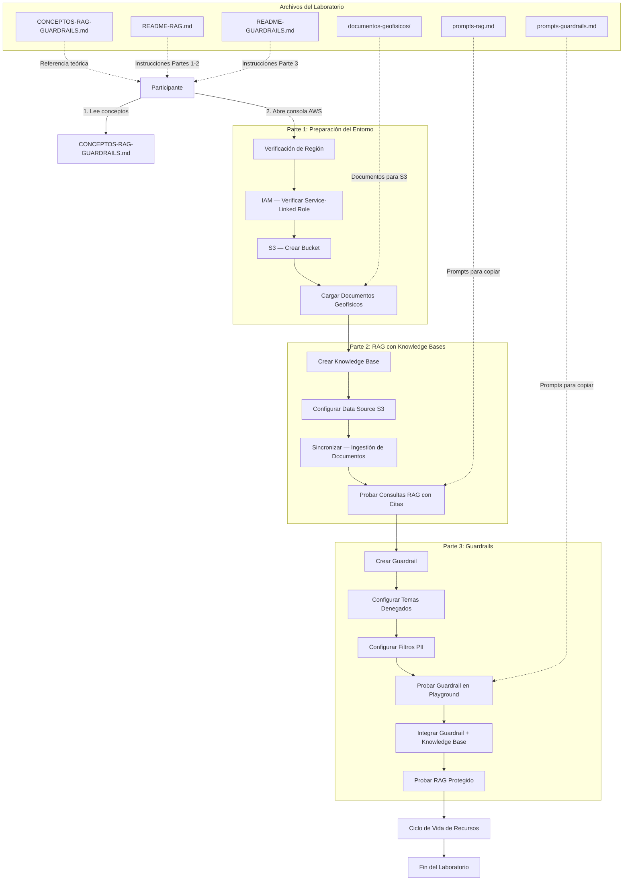
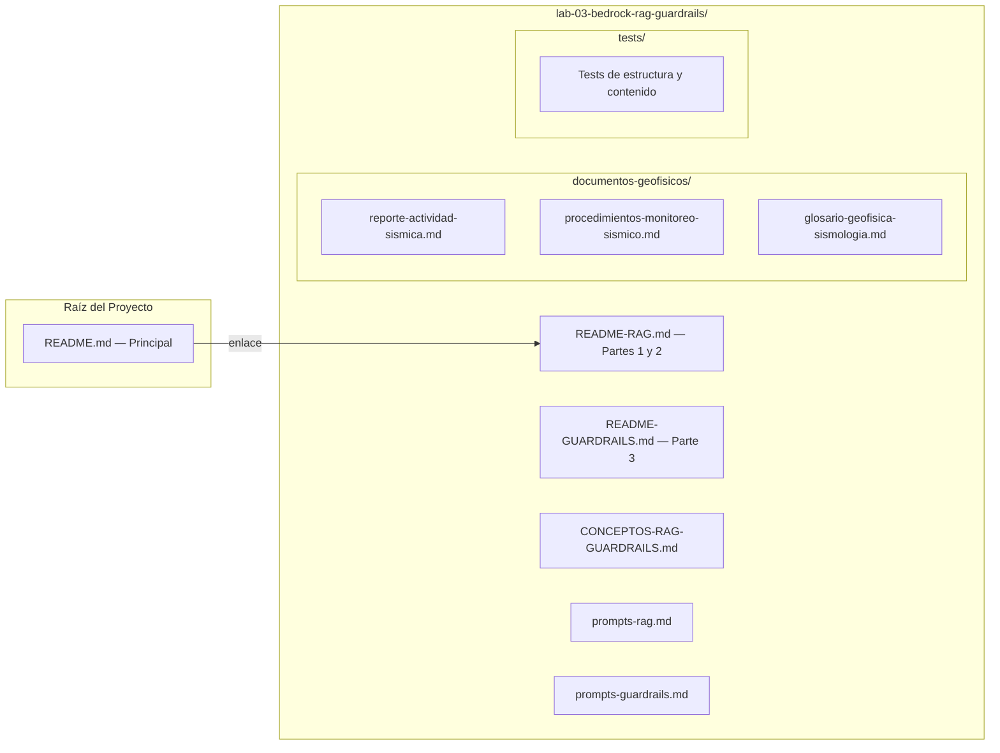
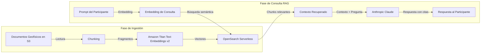
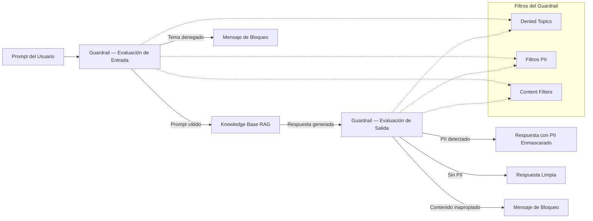

# Documento de Diseño — Lab 03: RAG y Guardrails con Amazon Bedrock

## Visión General

Este diseño describe la estructura, componentes y flujo de trabajo para el Laboratorio 03 de la serie AWS AI Essentials. El laboratorio guía al participante en la implementación de Generación Aumentada por Recuperación (RAG) mediante Amazon Bedrock Knowledge Bases y la configuración de filtros de seguridad mediante Amazon Bedrock Guardrails, aplicados al dominio de la geofísica y sismología.

El laboratorio se divide en tres partes progresivas y produce ocho entregables principales:

1. **`CONCEPTOS-RAG-GUARDRAILS.md`**: Documento de referencia teórica con secciones pedagógicas sobre RAG, Knowledge Bases, bases de datos vectoriales, embeddings en práctica, Guardrails, temas denegados, filtros PII y filtros de contenido, contextualizado en geofísica.
2. **`README-RAG.md`**: Guía paso a paso de las Partes 1 y 2 del laboratorio (preparación del entorno IAM/S3 + configuración y consulta de Knowledge Base RAG).
3. **`README-GUARDRAILS.md`**: Guía paso a paso de la Parte 3 del laboratorio (configuración de Guardrails, validación en Playground e integración con Knowledge Base).
4. **`documentos-geofisicos/`**: Subdirectorio con al menos 3 documentos geofísicos de soporte (TXT/MD) que contienen datos sísmicos, procedimientos de monitoreo, glosario técnico y datos PII ficticios de investigadores de campo.
5. **`prompts-rag.md`**: Archivo de soporte con todos los prompts de prueba para la Knowledge Base RAG.
6. **`prompts-guardrails.md`**: Archivo de soporte con todos los prompts de prueba para Guardrails (temas denegados, PII, integración).
7. **`README.md` (raíz)**: README principal del proyecto actualizado con Lab 03 en la tabla de laboratorios.
8. **`tests/`**: Suite de tests automatizados con Vitest + fast-check.

A diferencia del Lab 02 (Bedrock Playgrounds) que utiliza modelos preentrenados directamente, el Lab 03 introduce dos capas adicionales: RAG para fundamentar respuestas en documentos verificados y Guardrails para aplicar políticas de seguridad. El laboratorio NO utiliza recursos creados en laboratorios anteriores pero expande conceptos introducidos en el Lab 02.

Duración estimada: 50-60 minutos (30-35 min Partes 1 y 2, 20-25 min Parte 3).

## Arquitectura

### Diagrama de Flujo del Laboratorio



### Diagrama de Estructura de Archivos



### Flujo de Arquitectura RAG



### Flujo de Evaluación de Guardrails




## Componentes e Interfaces

### Componente 1: Guía de Conceptos de RAG y Guardrails (`CONCEPTOS-RAG-GUARDRAILS.md`)

**Responsabilidad**: Proveer el marco teórico de RAG, Knowledge Bases, bases de datos vectoriales, Guardrails y filtros de seguridad necesario para interpretar el laboratorio, con secciones pedagógicas organizadas de lo básico a lo avanzado, contextualizado en geofísica.

**Estructura interna**:
- Título con emoji único: `🗄️ Conceptos Fundamentales: RAG y Guardrails con Amazon Bedrock`
- Índice con enlaces de ancla a cada sección
- Secciones en orden pedagógico:
  1. El Problema que RAG Resuelve (limitación de LLMs, knowledge cutoff, alucinaciones de dominio, analogía geofísica con catálogo sísmico del IGP)
  2. Arquitectura de RAG Paso a Paso (Fase de Ingestión: chunking → embeddings → vector store; Fase de Consulta: embedding de query → búsqueda semántica → contexto; Fase de Generación: respuesta con citas)
  3. Embeddings en Práctica y Bases de Datos Vectoriales (expansión del concepto del Lab 02, uso concreto en RAG, similitud semántica, Amazon OpenSearch Serverless, enlace a CONCEPTOS-IA-GENERATIVA.md)
  4. Knowledge Bases en Amazon Bedrock (definición, componentes: S3 + Titan Embeddings + OpenSearch + Claude, Chunking Strategy: default/fixed size/none)
  5. Guardrails para Amazon Bedrock (definición, evaluación de entrada y salida, temas denegados, filtros PII, filtros de contenido, mensaje de bloqueo personalizado)
  6. Integración de Guardrails con RAG (flujo completo, caso de uso geofísico, trazabilidad/Trace)
  7. Preparación del Entorno (IAM Service Role, bucket S3 como Data Source, cifrado SSE-S3, convención de nombres con `{nombre-participante}`)
  8. Terminología AWS (consistencia con documentación oficial de Amazon Bedrock)
- Formato consistente con `CONCEPTOS-IA-GENERATIVA.md` del Lab 02 y `CONCEPTOS-ML.md` del Lab 01 (separadores `---`, bloques de código, tablas)
- Referencia explícita a `CONCEPTOS-IA-GENERATIVA.md` del Lab 02 para conceptos base

**Interfaz con READMEs**: Ambos READMEs (RAG y Guardrails) referencian este documento en prerrequisitos y mediante enlaces contextuales en pasos específicos donde los conceptos son relevantes.

### Componente 2: Guía del Laboratorio — Partes 1 y 2 (`README-RAG.md`)

**Responsabilidad**: Instrucciones paso a paso para la preparación del entorno (IAM, S3) y la configuración y consulta de la Knowledge Base RAG.

**Estructura interna** (según directrices):
1. Título con emoji único: `🗃️ Laboratorio 3 — Parte 1 y 2: RAG con Amazon Bedrock Knowledge Bases`
2. Índice con enlaces de ancla
3. Tiempo estimado: 30-35 minutos
4. Objetivos de aprendizaje (3-4 puntos: configurar infraestructura IAM/S3, crear Knowledge Base, ejecutar consultas RAG con citas)
5. Prerrequisitos (acceso a Amazon Bedrock, modelos habilitados, referencia a CONCEPTOS-RAG-GUARDRAILS.md)
6. Indicación de independencia de Labs 01 y 02
7. Instrucciones paso a paso numeradas:
   - **Parte 1: Preparación del Entorno**
     - Paso 1: Verificación de región AWS
     - Paso 2: Verificar Service-Linked Role de IAM para Bedrock (entidad de confianza `bedrock.amazonaws.com`, permisos S3 lectura + OpenSearch `aoss:APIAccessAll`)
     - Paso 3: Crear bucket S3 `s3-lab03-knowledge-source-{nombre-participante}` con SSE-S3
     - Paso 4: Cargar documentos geofísicos de `documentos-geofisicos/` al bucket
   - **Parte 2: RAG con Knowledge Bases**
     - Paso 5: Crear Knowledge Base con nombre incluyendo `{nombre-participante}`, seleccionar Amazon Titan Text Embeddings v2, Quick create OpenSearch Serverless, conectar bucket S3
     - Paso 6: Configurar Data Source con URI `s3://s3-lab03-knowledge-source-{nombre-participante}/`
     - Paso 7: Ejecutar sincronización (Sync) y esperar estado "Available"
     - Paso 8: Seleccionar modelo Anthropic Claude para generación
     - Paso 9: Probar consultas RAG con prompts de `prompts-rag.md` (3 consultas geofísicas + 1 consulta fuera de dominio)
     - Paso 10: Verificar citas/referencias en respuestas RAG
8. Puntos de verificación visual (`✓ Verificación`) después de cada paso mayor
9. Referencia a `prompts-rag.md` en cada paso donde se utilice un prompt
10. Referencia a documentos geofísicos por nombre y ruta relativa
11. Sección de Solución de Problemas con referencia a `TROUBLESHOOTING.md`

**Interfaz con archivos de soporte**: Referencia explícita a `prompts-rag.md`, `documentos-geofisicos/` y `CONCEPTOS-RAG-GUARDRAILS.md`.

### Componente 3: Guía del Laboratorio — Parte 3 (`README-GUARDRAILS.md`)

**Responsabilidad**: Instrucciones paso a paso para la configuración de Guardrails, validación en Playground e integración con la Knowledge Base.

**Estructura interna** (según directrices):
1. Título con emoji único: `🛡️ Laboratorio 3 — Parte 3: Guardrails con Amazon Bedrock`
2. Índice con enlaces de ancla
3. Tiempo estimado: 20-25 minutos
4. Objetivos de aprendizaje (3-4 puntos: configurar Guardrails, probar temas denegados, filtrar PII, integrar con RAG)
5. Prerrequisitos (Knowledge Base creada en Parte 2, referencia a CONCEPTOS-RAG-GUARDRAILS.md)
6. Instrucciones paso a paso numeradas (continuación de la Parte 2):
   - **Configuración de Guardrails**
     - Paso 11: Crear Guardrail con nombre incluyendo `{nombre-participante}`, mensaje de bloqueo personalizado en español
     - Paso 12: Configurar tema denegado 1 — "Predicción exacta de terremotos"
     - Paso 13: Configurar tema denegado 2 — "Diagnóstico de estabilidad estructural"
     - Paso 14: Configurar filtros PII (Email → Redact, Phone → Redact, Name → Redact), explicar diferencia Block vs Redact
     - Paso 15: Configurar filtros de contenido (Hate, Insults, Sexual, Violence, Misconduct) con niveles recomendados
   - **Validación en Playground**
     - Paso 16: Probar temas denegados con prompts de `prompts-guardrails.md` (predicción de terremotos, diagnóstico estructural)
     - Paso 17: Probar filtro PII con prompt de investigador ficticio (Dr. Carlos Mendoza)
     - Paso 18: Examinar métricas de trazabilidad (Trace)
   - **Integración con Knowledge Base**
     - Paso 19: Asociar Guardrail a Knowledge Base (seleccionar versión)
     - Paso 20: Probar consulta RAG que extraiga PII de documentos indexados
     - Paso 21: Probar consulta RAG que viole tema denegado
     - Paso 22: Comparar respuestas RAG con y sin Guardrail
7. Puntos de verificación visual (`✓ Verificación`) después de cada paso mayor
8. Referencia a `prompts-guardrails.md` en cada paso donde se utilice un prompt
9. Sección de Ciclo de Vida de Recursos (recursos creados, conservar para Lab 04, limpieza opcional con orden correcto, nota de costos)
10. Indicación de continuación en Lab 04
11. Sección de Solución de Problemas con referencia a `TROUBLESHOOTING.md`

### Componente 4: Documentos Geofísicos de Soporte (`documentos-geofisicos/`)

**Responsabilidad**: Proveer documentos geofísicos de ejemplo para cargar al bucket S3 y alimentar la Knowledge Base, con contenido verificable y datos PII ficticios para probar Guardrails.

**Estructura interna**:
- `reporte-actividad-sismica.md`: Reporte de actividad sísmica con datos de estaciones, magnitudes, profundidades, coordenadas de eventos recientes. Incluye PII ficticios de investigadores de campo (nombres, correos, teléfonos).
- `procedimientos-monitoreo-sismico.md`: Guía de procedimientos de monitoreo sísmico con protocolos de operación de estaciones sismológicas. Incluye PII ficticios de sismólogos responsables.
- `glosario-geofisica-sismologia.md`: Glosario técnico de geofísica y sismología con definiciones de términos del dominio. Incluye PII ficticios de autores/revisores.

**Requisitos de contenido**:
- Información técnicamente precisa sobre geofísica y sismología
- Datos PII ficticios distribuidos en los documentos (nombres, correos `@igp.gob.pe`, teléfonos `+51-XXX-XXX-XXX`)
- Formato compatible con RAG (Markdown)
- Contenido suficiente para demostrar búsqueda semántica y citas

### Componente 5: Archivos de Prompts de Soporte

**Componente 5a: Prompts RAG (`prompts-rag.md`)**

**Responsabilidad**: Proveer todos los prompts de prueba para la Knowledge Base RAG en formato fácil de copiar/pegar.

**Estructura interna**:
- Título descriptivo
- Secciones organizadas:
  - Prompts de prueba RAG (al menos 3 consultas geofísicas: datos sísmicos específicos, síntesis de múltiples documentos, tema no contenido)
  - Cada prompt en bloque de código

**Componente 5b: Prompts Guardrails (`prompts-guardrails.md`)**

**Responsabilidad**: Proveer todos los prompts de prueba para Guardrails en formato fácil de copiar/pegar.

**Estructura interna**:
- Título descriptivo
- Secciones organizadas:
  - Prompts de temas denegados (predicción de terremotos, diagnóstico estructural)
  - Prompt de PII (investigador ficticio Dr. Carlos Mendoza)
  - Prompts de integración RAG + Guardrails (PII en documentos indexados, tema denegado con KB)
  - Cada prompt en bloque de código

### Componente 6: README Principal del Proyecto (`README.md` en raíz)

**Responsabilidad**: Actualizar la visión general del programa AWS AI Essentials con Lab 03 en la tabla de laboratorios.

**Cambios requeridos**:
1. Tabla de laboratorios: Actualizar Lab 03 de "Próximamente" a enlace activo con título "RAG y Guardrails con Amazon Bedrock", descripción y tiempo "55 min"
2. Objetivos de aprendizaje: Agregar objetivos de Lab 03 (implementar RAG, configurar Guardrails)
3. Contenido adicional: Agregar enlaces a documentación de Amazon Bedrock Knowledge Bases y Guardrails
4. Mantener Labs 04 y 05 como "Próximamente"

### Componente 7: Suite de Tests (`tests/`)

**Responsabilidad**: Verificar la estructura y contenido de todos los documentos del laboratorio mediante pruebas automatizadas.

**Estructura**:
- `tests/conceptos-rag-guardrails-structure.property.test.ts`: Tests de propiedad para estructura del documento de conceptos
- `tests/conceptos-rag-guardrails-content.test.ts`: Tests unitarios de contenido de cada sección
- `tests/readme-rag-structure.property.test.ts`: Tests de propiedad para estructura del README-RAG
- `tests/readme-rag-content.test.ts`: Tests unitarios de contenido del README-RAG
- `tests/readme-guardrails-structure.property.test.ts`: Tests de propiedad para estructura del README-GUARDRAILS
- `tests/readme-guardrails-content.test.ts`: Tests unitarios de contenido del README-GUARDRAILS
- `tests/prompts-rag-content.test.ts`: Tests de contenido del archivo de prompts RAG
- `tests/prompts-guardrails-content.test.ts`: Tests de contenido del archivo de prompts Guardrails
- `tests/documentos-geofisicos-content.test.ts`: Tests de contenido de los documentos geofísicos
- `tests/readme-principal.test.ts`: Tests de contenido del README principal actualizado
- `tests/readme-principal.property.test.ts`: Tests de propiedad para estructura del README principal

**Tecnología**: Vitest + fast-check (misma stack que Lab 01 y Lab 02)


## Modelos de Datos

### Modelo de Estructura de Documentos

```
Estructura_Laboratorio_03 {
  carpeta: "lab-03-bedrock-rag-guardrails/"
  archivos: {
    "README-RAG.md": Guia_RAG
    "README-GUARDRAILS.md": Guia_Guardrails
    "CONCEPTOS-RAG-GUARDRAILS.md": Guia_Conceptos_RAG_Guardrails
    "prompts-rag.md": Archivo_Prompts_RAG
    "prompts-guardrails.md": Archivo_Prompts_Guardrails
    "documentos-geofisicos/": Documentos_Soporte
    "tests/": Suite_Tests
    "package.json": Configuracion_Tests
    "vitest.config.ts": Configuracion_Vitest
    "tsconfig.json": Configuracion_TypeScript
  }
}

Estructura_Raiz {
  "README.md": README_Principal  // Actualizado con Lab 03
}
```

### Modelo de la Guía de Conceptos

```
Guia_Conceptos_RAG_Guardrails {
  titulo: string              // Con emoji único al inicio (🗄️)
  indice: Seccion[]           // Con enlaces de ancla
  secciones: [
    Problema_Que_RAG_Resuelve,
    Arquitectura_RAG_Paso_A_Paso,
    Embeddings_En_Practica_Y_Vectores,
    Knowledge_Bases_En_Bedrock,
    Guardrails_Para_Bedrock,
    Integracion_Guardrails_RAG,
    Preparacion_Del_Entorno,
    Terminologia_AWS
  ]
  referencia_lab02: string    // Enlace a CONCEPTOS-IA-GENERATIVA.md
}
```

### Modelo de Documentos Geofísicos

```
Documento_Geofisico {
  titulo: string
  contenido_tecnico: string       // Información verificable de geofísica
  datos_pii: PII_Ficticio[]       // Datos PII distribuidos en el contenido
  formato: "MD" | "TXT"
}

PII_Ficticio {
  nombre: string                  // Ej. "Dr. Carlos Mendoza"
  correo: string                  // Ej. "investigador@igp.gob.pe"
  telefono: string                // Ej. "+51-999-888-777"
  rol: string                     // Ej. "Investigador de campo", "Sismólogo"
}
```

### Modelo de Prompts RAG

```
Archivo_Prompts_RAG {
  prompt_datos_sismicos: string        // Consulta sobre datos específicos en documentos
  prompt_sintesis: string              // Consulta que requiere síntesis de múltiples documentos
  prompt_fuera_dominio: string         // Consulta sobre tema NO contenido en documentos
}
```

### Modelo de Prompts Guardrails

```
Archivo_Prompts_Guardrails {
  prompt_prediccion_terremotos: string     // Viola tema denegado 1
  prompt_diagnostico_estructural: string   // Viola tema denegado 2
  prompt_pii_investigador: string          // Contiene PII ficticio (Dr. Carlos Mendoza)
  prompt_integracion_pii_rag: string       // Extrae PII de documentos indexados
  prompt_integracion_tema_rag: string      // Viola tema denegado con KB activa
}
```

### Modelo de Knowledge Base

```
Knowledge_Base {
  nombre: string                          // Incluye {nombre-participante}
  modelo_embeddings: "Amazon Titan Text Embeddings v2"
  vector_store: "Amazon OpenSearch Serverless"  // Quick create
  data_source: {
    tipo: "S3"
    uri: "s3://s3-lab03-knowledge-source-{nombre-participante}/"
    formato_documentos: ["MD", "TXT"]
  }
  modelo_generacion: "Anthropic Claude"   // Familia Claude disponible en Bedrock
  chunking_strategy: "Default" | "Fixed Size" | "None"
}
```

### Modelo de Guardrail

```
Guardrail {
  nombre: string                          // Incluye {nombre-participante}
  mensaje_bloqueo: string                 // En español, contextualizado en geofísica
  temas_denegados: [
    {
      nombre: "Predicción exacta de terremotos"
      descripcion: string                 // Justificación geofísica
    },
    {
      nombre: "Diagnóstico de estabilidad estructural"
      descripcion: string                 // Justificación de ingeniería
    }
  ]
  filtros_pii: [
    { tipo: "Email", accion: "Redact", reemplazo: "[EMAIL]" },
    { tipo: "Phone", accion: "Redact", reemplazo: "[PHONE]" },
    { tipo: "Name", accion: "Redact", reemplazo: "[NAME]" }
  ]
  filtros_contenido: {
    Hate: "None" | "Low" | "Medium" | "High"
    Insults: "None" | "Low" | "Medium" | "High"
    Sexual: "None" | "Low" | "Medium" | "High"
    Violence: "None" | "Low" | "Medium" | "High"
    Misconduct: "None" | "Low" | "Medium" | "High"
  }
}
```

### Modelo del README Principal

```
README_Principal {
  titulo: "☁️ AWS AI Essentials"
  tabla_laboratorios: [
    { numero: "01", titulo: "ML No-Code con Amazon SageMaker Canvas", tiempo: "40 min", estado: "Completado" },
    { numero: "02", titulo: "IA Generativa con Amazon Bedrock Playgrounds", tiempo: "40 min", estado: "Completado" },
    { numero: "03", titulo: "RAG y Guardrails con Amazon Bedrock", tiempo: "55 min", estado: "Completado" },
    { numero: "04", titulo: "Próximamente", tiempo: "—", estado: "Próximamente" },
    { numero: "05", titulo: "Próximamente", tiempo: "—", estado: "Próximamente" }
  ]
  licencia: "MIT — Copyright © 2026 AMBER CLOUD GLOBAL LLC"
}
```


## Propiedades de Correctitud

*Una propiedad es una característica o comportamiento que debe mantenerse verdadero en todas las ejecuciones válidas de un sistema — esencialmente, una declaración formal sobre lo que el sistema debe hacer. Las propiedades sirven como puente entre las especificaciones legibles por humanos y las garantías de correctitud verificables por máquina.*

### Propiedad 1: Estructura válida de CONCEPTOS-RAG-GUARDRAILS.md

*Para cualquier* documento CONCEPTOS-RAG-GUARDRAILS.md generado, este debe contener: exactamente un emoji al inicio del título, un índice con enlaces de ancla donde cada enlace apunte a una sección existente en el documento, y las secciones deben estar en orden pedagógico (El Problema que RAG Resuelve, Arquitectura de RAG, Embeddings en Práctica y Bases de Datos Vectoriales, Knowledge Bases en Amazon Bedrock, Guardrails para Amazon Bedrock, Integración de Guardrails con RAG, Preparación del Entorno, Terminología AWS).

**Validates: Requirements 1.1**

### Propiedad 2: Estructura válida de README-RAG.md

*Para cualquier* README-RAG.md generado, este debe contener: exactamente un emoji al inicio del título, un índice con enlaces de ancla donde cada enlace apunte a una sección existente, el tiempo estimado de finalización (30-35 minutos), una lista de objetivos de aprendizaje, y el primer paso numerado de las instrucciones debe ser la verificación de la región de AWS.

**Validates: Requirements 2.1, 11.1**

### Propiedad 3: Estructura válida de README-GUARDRAILS.md

*Para cualquier* README-GUARDRAILS.md generado, este debe contener: exactamente un emoji al inicio del título, un índice con enlaces de ancla donde cada enlace apunte a una sección existente, el tiempo estimado de finalización (20-25 minutos), y una lista de objetivos de aprendizaje.

**Validates: Requirements 11.2**

### Propiedad 4: Puntos de verificación visual después de pasos de configuración

*Para cualquier* paso en README-RAG.md o README-GUARDRAILS.md que involucre creación o configuración de recursos AWS (rol IAM, bucket S3, Knowledge Base, sincronización, Guardrail, temas denegados, filtros PII, integración), debe existir un punto de verificación visual (`✓ Verificación`) inmediatamente después del paso.

**Validates: Requirements 2.5, 3.9, 4.5, 5.4, 6.5**

### Propiedad 5: Referencias cruzadas a documentos de soporte en ambos READMEs

*Para cualquier* README-RAG.md o README-GUARDRAILS.md generado, debe contener al menos una referencia a `CONCEPTOS-RAG-GUARDRAILS.md` en la sección de prerrequisitos y al menos un enlace contextual a una sección específica de CONCEPTOS-RAG-GUARDRAILS.md dentro de las instrucciones paso a paso. Además, cada paso que utilice un prompt debe referenciar explícitamente el archivo de prompts correspondiente (`prompts-rag.md` o `prompts-guardrails.md`) por nombre.

**Validates: Requirements 8.3, 11.3**

### Propiedad 6: Documentos geofísicos válidos con PII

*Para cualquier* conjunto de documentos en `documentos-geofisicos/`, debe contener al menos 3 archivos en formato compatible con RAG (MD o TXT), y el conjunto completo de documentos debe contener al menos una instancia de cada tipo de PII ficticio: un patrón de correo electrónico, un patrón de número de teléfono y un nombre de persona identificable.

**Validates: Requirements 7.1, 7.2**

### Propiedad 7: Prompts en bloques de código en archivos de soporte

*Para cualquier* archivo de prompts (`prompts-rag.md` o `prompts-guardrails.md`), todos los prompts de prueba deben estar contenidos dentro de bloques de código (delimitados por triple backtick) para facilitar la copia directa.

**Validates: Requirements 8.4**

### Propiedad 8: Estructura válida del README Principal actualizado

*Para cualquier* README principal generado, este debe contener: exactamente un emoji al inicio del título, una tabla con exactamente 5 entradas de laboratorios donde Lab 03 tenga un enlace activo a `lab-03-bedrock-rag-guardrails/` con tiempo "55 min", enlaces funcionales a las carpetas de Labs 01, 02 y 03, y el texto de licencia MIT con "Copyright © 2026 AMBER CLOUD GLOBAL LLC".

**Validates: Requirements 10.1**

### Propiedad 9: Placeholder de nombre de participante en recursos AWS

*Para cualquier* nombre de recurso AWS mencionado en README-RAG.md o README-GUARDRAILS.md (bucket S3, Knowledge Base, Guardrail), debe contener el placeholder `{nombre-participante}` según la convención de nombres de las directrices del laboratorio.

**Validates: Requirements 11.7**


## Manejo de Errores

### Errores durante la ejecución del laboratorio

| Escenario | Causa | Manejo |
|-----------|-------|--------|
| Error de permisos al crear rol IAM o bucket S3 | Rol IAM insuficiente o políticas restrictivas de la cuenta | Notificar al instructor inmediatamente. No intentar solucionar por cuenta propia. |
| Service-Linked Role no existe para Bedrock | Rol no creado previamente por el instructor | Notificar al instructor. El rol debe tener entidad de confianza `bedrock.amazonaws.com`. |
| Error al crear Knowledge Base | Permisos insuficientes del rol de servicio para acceder a S3 u OpenSearch | Verificar permisos del rol IAM (lectura S3, `aoss:APIAccessAll`). Notificar al instructor si persiste. |
| Sincronización de Knowledge Base falla | Bucket S3 vacío, documentos en formato incompatible, o permisos insuficientes | Verificar que los documentos están en el bucket, en formato MD/TXT. Verificar accesibilidad del bucket por el rol de servicio. |
| Sincronización tarda demasiado | Volumen de documentos o carga del servicio | Esperar. El proceso puede tardar varios minutos. No cancelar ni reiniciar. |
| Knowledge Base no retorna resultados relevantes | Documentos no sincronizados o consulta fuera del dominio indexado | Verificar que el estado de la KB es "Available". Verificar que los documentos fueron sincronizados correctamente. |
| Respuestas RAG sin citas | Modelo no encuentra chunks relevantes o configuración de generación | Verificar que la sincronización completó exitosamente. Reformular la consulta para ser más específica. |
| Error al crear Guardrail | Permisos insuficientes o límite de Guardrails alcanzado | Notificar al instructor. Verificar límites de la cuenta. |
| Guardrail no bloquea tema denegado | Descripción del tema denegado demasiado vaga o prompt no coincide | Revisar la descripción del tema denegado. Asegurar que sea específica y en lenguaje natural claro. |
| Filtro PII no enmascara datos | Tipo de PII no habilitado o datos no reconocidos como PII | Verificar que los tipos de PII (Email, Phone, Name) están habilitados con acción Redact. |
| Error al asociar Guardrail con Knowledge Base | Versión del Guardrail no publicada | Verificar que se seleccionó la versión correcta del Guardrail (no el borrador). |
| Error de límite de cuota AWS | Cuota de servicio excedida en la cuenta compartida | Notificar al instructor. No crear recursos alternativos. |
| Modelo no disponible en la región | Modelo de embeddings o generación no habilitado | Verificar que el instructor habilitó los modelos. Confirmar la región correcta. |

### Errores en la generación de documentación

| Escenario | Causa | Manejo |
|-----------|-------|--------|
| Enlaces de ancla rotos en índice | Desincronización entre TOC y secciones | Validar que cada enlace del índice tiene su sección correspondiente. |
| Terminología inconsistente con AWS | Cambios en la interfaz de AWS | Validar con MCP Server de documentación AWS y actualizar. |
| Falta referencia a CONCEPTOS-RAG-GUARDRAILS.md | Omisión en generación de los READMEs | Verificar presencia de enlaces en prerrequisitos y pasos contextuales de ambos READMEs. |
| Prompts no coinciden entre READMEs y archivos de prompts | Edición parcial de uno de los archivos | Mantener `prompts-rag.md` y `prompts-guardrails.md` como fuentes de verdad y referenciar desde READMEs. |
| README Principal sin Lab 03 actualizado | Omisión en actualización de la tabla | Verificar que la tabla contiene Lab 03 con enlace activo y tiempo "55 min". |
| Documentos geofísicos sin PII | Omisión de datos PII ficticios | Verificar que cada documento contiene al menos un dato PII (nombre, correo o teléfono). |

## Estrategia de Pruebas

### Enfoque Dual de Pruebas

Este laboratorio requiere dos tipos complementarios de pruebas:

1. **Pruebas unitarias (ejemplos específicos)**: Verifican casos concretos, presencia de contenido y condiciones de borde.
2. **Pruebas basadas en propiedades (property-based testing)**: Verifican propiedades universales que deben cumplirse para todas las entradas válidas.

### Pruebas Basadas en Propiedades

**Librería**: `fast-check` (JavaScript/TypeScript) — misma stack que Lab 01 y Lab 02, seleccionada por su madurez, soporte de generadores personalizados y compatibilidad con Vitest.

**Configuración**: Mínimo 100 iteraciones por prueba de propiedad.

**Etiquetado**: Cada prueba debe incluir un comentario con el formato:
`// Feature: lab-03-bedrock-rag-guardrails, Property {N}: {descripción}`

**Cada propiedad de correctitud debe ser implementada por UNA SOLA prueba basada en propiedades.**

#### Pruebas de Propiedad a Implementar

| Propiedad | Archivo de Test | Descripción |
|-----------|----------------|-------------|
| P1 | `conceptos-rag-guardrails-structure.property.test.ts` | Validar estructura de CONCEPTOS-RAG-GUARDRAILS.md: emoji en título, índice con anclas válidas, 8 secciones en orden pedagógico |
| P2 | `readme-rag-structure.property.test.ts` | Validar estructura del README-RAG: emoji en título, índice con anclas, tiempo estimado, objetivos, primer paso como verificación de región |
| P3 | `readme-guardrails-structure.property.test.ts` | Validar estructura del README-GUARDRAILS: emoji en título, índice con anclas, tiempo estimado, objetivos |
| P4 | `readme-rag-structure.property.test.ts` + `readme-guardrails-structure.property.test.ts` | Validar presencia de checkpoints `✓ Verificación` después de pasos de configuración en ambos READMEs |
| P5 | `readme-rag-structure.property.test.ts` + `readme-guardrails-structure.property.test.ts` | Validar referencias cruzadas a CONCEPTOS-RAG-GUARDRAILS.md y archivos de prompts en ambos READMEs |
| P6 | `documentos-geofisicos-content.test.ts` | Validar al menos 3 documentos geofísicos con PII ficticio (email, teléfono, nombre) |
| P7 | `prompts-rag-content.test.ts` + `prompts-guardrails-content.test.ts` | Validar que todos los prompts están en bloques de código |
| P8 | `readme-principal.property.test.ts` | Validar estructura del README Principal: emoji, tabla con 5 labs, Lab 03 con enlace activo y 55 min, licencia MIT |
| P9 | `readme-rag-structure.property.test.ts` + `readme-guardrails-structure.property.test.ts` | Validar placeholder `{nombre-participante}` en nombres de recursos AWS |

### Pruebas Unitarias (Ejemplos y Casos de Borde)

Las pruebas unitarias cubren los criterios de aceptación marcados como "example":

| Criterio | Archivo de Test | Prueba | Tipo |
|----------|----------------|--------|------|
| 1.2 | `conceptos-rag-guardrails-content.test.ts` | Sección RAG: contiene limitación LLMs, knowledge cutoff, solución RAG, analogía geofísica | Ejemplo |
| 1.3 | `conceptos-rag-guardrails-content.test.ts` | Sección Arquitectura RAG: contiene Ingestión, chunking, embeddings, Consulta, búsqueda semántica, Generación, citas | Ejemplo |
| 1.4 | `conceptos-rag-guardrails-content.test.ts` | Sección Embeddings: contiene similitud semántica, OpenSearch Serverless, enlace a CONCEPTOS-IA-GENERATIVA.md | Ejemplo |
| 1.5 | `conceptos-rag-guardrails-content.test.ts` | Sección Knowledge Bases: contiene S3, Titan Embeddings, OpenSearch, Claude, Chunking Strategy | Ejemplo |
| 1.6 | `conceptos-rag-guardrails-content.test.ts` | Sección Guardrails: contiene temas denegados, filtros PII, filtros de contenido, mensaje de bloqueo | Ejemplo |
| 1.7 | `conceptos-rag-guardrails-content.test.ts` | Sección Integración: contiene flujo completo, caso geofísico, Trace/trazabilidad | Ejemplo |
| 1.8 | `conceptos-rag-guardrails-content.test.ts` | Sección Preparación: contiene IAM Service Role, S3, SSE-S3, {nombre-participante} | Ejemplo |
| 1.10 | `conceptos-rag-guardrails-content.test.ts` | Referencia explícita a CONCEPTOS-IA-GENERATIVA.md del Lab 02 | Ejemplo |
| 2.2 | `readme-rag-content.test.ts` | Pasos IAM: Service-Linked Role, bedrock.amazonaws.com, aoss:APIAccessAll | Ejemplo |
| 2.3 | `readme-rag-content.test.ts` | Pasos S3: bucket s3-lab03-knowledge-source, SSE-S3 | Ejemplo |
| 2.4 | `readme-rag-content.test.ts` | Pasos carga: referencia a documentos-geofisicos/ | Ejemplo |
| 2.6 | `readme-rag-content.test.ts` | Error handling: notificar al instructor ante errores de permisos | Ejemplo |
| 3.1 | `readme-rag-content.test.ts` | Knowledge Base: Titan Text Embeddings v2, OpenSearch Serverless, Quick create | Ejemplo |
| 3.2 | `readme-rag-content.test.ts` | Data Source: URI s3://s3-lab03-knowledge-source | Ejemplo |
| 3.3 | `readme-rag-content.test.ts` | Sincronización: Sync, chunking, embeddings, OpenSearch | Ejemplo |
| 3.4 | `readme-rag-content.test.ts` | Nota de espera: tiempo de sincronización, estado Available | Ejemplo |
| 3.5 | `readme-rag-content.test.ts` | Prompts RAG: referencia a prompts-rag.md, al menos 3 consultas | Ejemplo |
| 3.6 | `readme-rag-content.test.ts` | Citas: verificar presencia de citas/referencias en respuestas | Ejemplo |
| 3.7 | `readme-rag-content.test.ts` | Modelo: Anthropic Claude para generación | Ejemplo |
| 3.8 | `readme-rag-content.test.ts` | Diagnóstico: pasos de diagnóstico si KB o sync falla | Ejemplo |
| 4.1 | `readme-guardrails-content.test.ts` | Crear Guardrail: nombre con participante, mensaje de bloqueo personalizado | Ejemplo |
| 4.2 | `readme-guardrails-content.test.ts` | Temas denegados: predicción de terremotos, diagnóstico de estabilidad estructural | Ejemplo |
| 4.3 | `readme-guardrails-content.test.ts` | Filtros PII: Email, Phone, Name, Redact, diferencia Block vs Redact | Ejemplo |
| 4.4 | `readme-guardrails-content.test.ts` | Filtros contenido: Hate, Insults, Sexual, Violence, Misconduct, niveles de severidad | Ejemplo |
| 5.1 | `readme-guardrails-content.test.ts` | Prompts temas denegados: predicción terremoto Pacífico, diagnóstico estación Ñaña | Ejemplo |
| 5.2 | `readme-guardrails-content.test.ts` | Prompt PII: Dr. Carlos Mendoza, [NAME], [EMAIL], [PHONE] | Ejemplo |
| 5.3 | `readme-guardrails-content.test.ts` | Trazabilidad: Trace, identificación de filtro responsable | Ejemplo |
| 6.1 | `readme-guardrails-content.test.ts` | Integración: asociar Guardrail a Knowledge Base, seleccionar versión | Ejemplo |
| 6.2 | `readme-guardrails-content.test.ts` | Integración PII: prompt que demuestre enmascaramiento en respuestas RAG | Ejemplo |
| 6.3 | `readme-guardrails-content.test.ts` | Integración tema: prompt que demuestre bloqueo con KB activa | Ejemplo |
| 6.4 | `readme-guardrails-content.test.ts` | Comparación: respuestas RAG con y sin Guardrail | Ejemplo |
| 7.4 | `readme-rag-content.test.ts` | Referencia a documentos geofísicos por nombre y ruta relativa | Ejemplo |
| 8.1 | `prompts-rag-content.test.ts` | prompts-rag.md: al menos 3 consultas RAG geofísicas + 1 fuera de dominio | Ejemplo |
| 8.2 | `prompts-guardrails-content.test.ts` | prompts-guardrails.md: temas denegados, PII, integración RAG+Guardrails | Ejemplo |
| 9.1 | `readme-guardrails-content.test.ts` | Ciclo de vida: recursos creados, conservar para Lab 04, limpieza opcional con orden | Ejemplo |
| 9.2 | `readme-guardrails-content.test.ts` | Costos: OpenSearch Serverless, tokens RAG | Ejemplo |
| 9.3 | `readme-guardrails-content.test.ts` | Limpieza: vaciar bucket S3, KB no elimina OpenSearch automáticamente | Ejemplo |
| 10.2 | `readme-principal.test.ts` | Labs 04 y 05 con estado "Próximamente" | Ejemplo |
| 10.3 | `readme-principal.test.ts` | Objetivos de aprendizaje incluyen RAG y Guardrails | Ejemplo |
| 10.4 | `readme-principal.test.ts` | Contenido adicional: enlaces a documentación de KB y Guardrails | Ejemplo |
| 11.4 | `readme-rag-content.test.ts` | Independencia de Labs 01 y 02 | Ejemplo |
| 11.5 | `readme-guardrails-content.test.ts` | Continuación en Lab 04 | Ejemplo |
| 13.1 | `readme-rag-content.test.ts` | Configuración de tests: package.json, vitest.config.ts, tsconfig.json | Ejemplo |

### Configuración del Proyecto de Tests

```
lab-03-bedrock-rag-guardrails/
├── package.json          # vitest + fast-check como devDependencies
├── vitest.config.ts      # include: ['tests/**/*.test.ts']
├── tsconfig.json         # ES2022, ESNext, bundler
├── CONCEPTOS-RAG-GUARDRAILS.md
├── README-RAG.md
├── README-GUARDRAILS.md
├── prompts-rag.md
├── prompts-guardrails.md
├── documentos-geofisicos/
│   ├── reporte-actividad-sismica.md
│   ├── procedimientos-monitoreo-sismico.md
│   └── glosario-geofisica-sismologia.md
└── tests/
    ├── conceptos-rag-guardrails-structure.property.test.ts
    ├── conceptos-rag-guardrails-content.test.ts
    ├── readme-rag-structure.property.test.ts
    ├── readme-rag-content.test.ts
    ├── readme-guardrails-structure.property.test.ts
    ├── readme-guardrails-content.test.ts
    ├── prompts-rag-content.test.ts
    ├── prompts-guardrails-content.test.ts
    ├── documentos-geofisicos-content.test.ts
    ├── readme-principal.test.ts
    └── readme-principal.property.test.ts
```

**Dependencias** (mismas que Lab 01 y Lab 02):
- `vitest`: ^3.2.1
- `fast-check`: ^4.1.1

**Ejecución**: `npm test` (ejecuta `vitest --run`)
