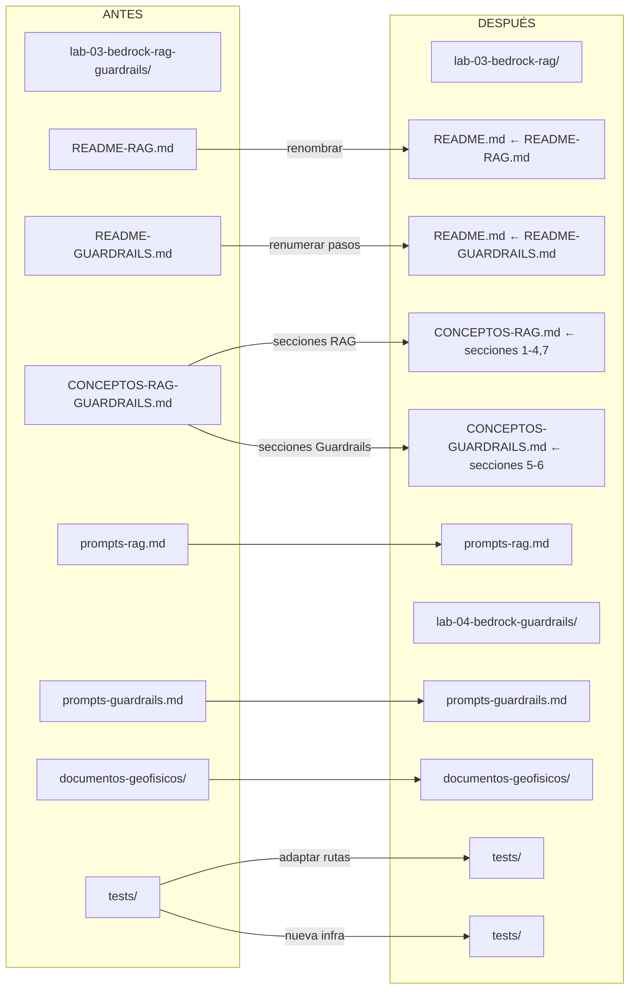
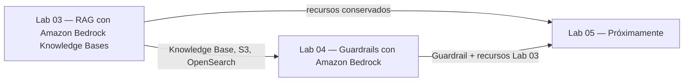
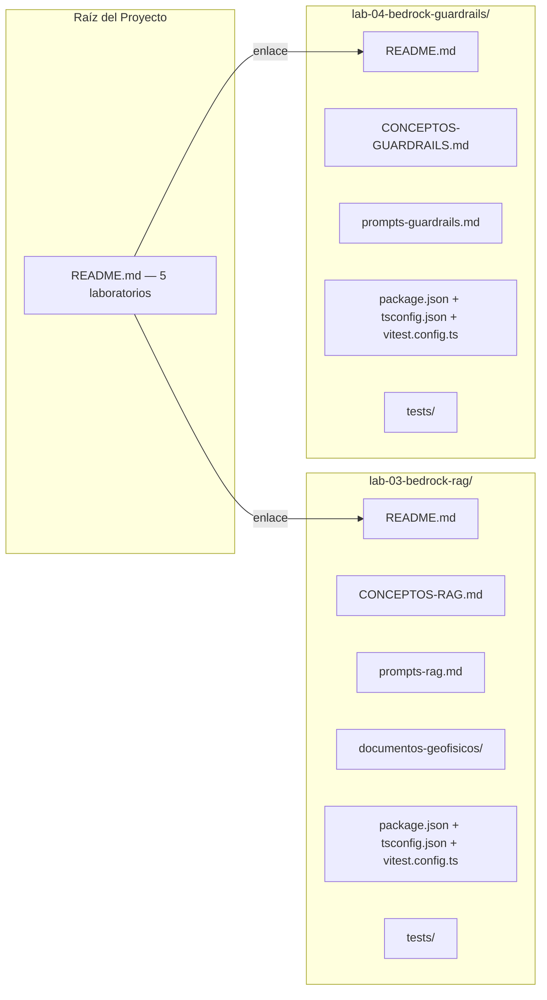

# Documento de Diseño — Lab 04: Guardrails con Amazon Bedrock (Separación de Laboratorios)

## Visión General

Este diseño describe la reorganización del Laboratorio 03 original (`lab-03-bedrock-rag-guardrails/`) en dos laboratorios independientes, enfocándose en la creación del Lab 04 dedicado a Guardrails y las transformaciones necesarias en el Lab 03 existente. El trabajo es exclusivamente de reestructuración de documentación — no se crea contenido instruccional nuevo.

La reorganización produce los siguientes cambios:

1. **Renombrar** `lab-03-bedrock-rag-guardrails/` → `lab-03-bedrock-rag/`
2. **Crear** `lab-04-bedrock-guardrails/` como laboratorio independiente
3. **Separar** `CONCEPTOS-RAG-GUARDRAILS.md` en dos documentos: `CONCEPTOS-RAG.md` (Lab 03) y `CONCEPTOS-GUARDRAILS.md` (Lab 04)
4. **Redistribuir** archivos de soporte entre ambos laboratorios
5. **Actualizar** el README principal del proyecto con la tabla de 5 laboratorios
6. **Configurar** infraestructura de tests independiente para Lab 04

El contenido instruccional permanece intacto. Los cambios se limitan a: renombrar archivos/directorios, separar documentos, actualizar títulos/introducciones/índices, renumerar pasos (11-22 → 1-12), actualizar referencias internas y crear infraestructura de tests.

## Arquitectura

### Diagrama de Transformación de Estructura



### Diagrama de Dependencias entre Laboratorios



### Estructura de Archivos Resultante




## Componentes e Interfaces

### Componente 1: Renombrar Directorio Lab 03 (`lab-03-bedrock-rag-guardrails/` → `lab-03-bedrock-rag/`)

**Responsabilidad**: Renombrar el directorio del laboratorio original para reflejar su enfoque exclusivo en RAG.

**Transformaciones**:
- Renombrar directorio `lab-03-bedrock-rag-guardrails/` a `lab-03-bedrock-rag/`
- Renombrar `README-RAG.md` a `README.md` (guía principal del Lab 03)
- Eliminar `README-GUARDRAILS.md` (se mueve al Lab 04)
- Eliminar `prompts-guardrails.md` (se mueve al Lab 04)
- Eliminar `CONCEPTOS-RAG-GUARDRAILS.md` (se reemplaza por `CONCEPTOS-RAG.md`)
- Conservar: `prompts-rag.md`, `documentos-geofisicos/`, `package.json`, `tsconfig.json`, `vitest.config.ts`, `tests/`

### Componente 2: README del Lab 03 (`lab-03-bedrock-rag/README.md`)

**Responsabilidad**: Adaptar el contenido de `README-RAG.md` como guía principal independiente del Lab 03.

**Transformaciones sobre el contenido existente de README-RAG.md**:
- Título: `🗃️ Laboratorio 3 — RAG con Amazon Bedrock Knowledge Bases` (eliminar "Parte 1 y 2")
- Tiempo estimado: 30-35 minutos (sin cambio)
- Eliminar referencias a "Parte 1 y 2" en título e índice
- Actualizar todas las referencias de `CONCEPTOS-RAG-GUARDRAILS.md` a `CONCEPTOS-RAG.md` con rutas relativas locales
- Actualizar anchor links de conceptos para reflejar la nueva numeración del documento separado
- Agregar nota de continuación: los recursos creados (Knowledge Base, bucket S3, vector store) deben conservarse para el Lab 04
- Mantener intacto: contenido instruccional (pasos 1-10), verificaciones, solución de problemas

**Interfaz**: Referencia a `CONCEPTOS-RAG.md`, `prompts-rag.md`, `documentos-geofisicos/`

### Componente 3: Directorio Lab 04 (`lab-04-bedrock-guardrails/`)

**Responsabilidad**: Crear el directorio del nuevo laboratorio dedicado a Guardrails.

**Contenido**:
- `README.md` — Guía principal (adaptada de `README-GUARDRAILS.md`)
- `CONCEPTOS-GUARDRAILS.md` — Documento de conceptos (secciones 5-6 del original)
- `prompts-guardrails.md` — Archivo de prompts (copiado sin cambios)
- `package.json` — Configuración de tests
- `tsconfig.json` — Configuración TypeScript
- `vitest.config.ts` — Configuración Vitest
- `tests/` — Directorio de tests con placeholder

### Componente 4: README del Lab 04 (`lab-04-bedrock-guardrails/README.md`)

**Responsabilidad**: Adaptar el contenido de `README-GUARDRAILS.md` como guía principal independiente del Lab 04.

**Transformaciones sobre el contenido existente de README-GUARDRAILS.md**:
- Título: `🛡️ Laboratorio 4 — Guardrails con Amazon Bedrock` (eliminar "Parte 3", cambiar "Laboratorio 3" a "Laboratorio 4")
- Tiempo estimado: 20-25 minutos (sin cambio)
- Eliminar referencias a "Parte 3" en título e índice
- Renumerar pasos: 11→1, 12→2, 13→3, ..., 22→12
- Actualizar índice con anchor links para la nueva numeración (Paso 1 a Paso 12)
- Comenzar con verificación de región AWS como primer paso (Paso 1), insertando el paso estándar de verificación de región antes del contenido actual del Paso 11
- Renumerar los pasos originales 11-22 como 2-13 (total: 13 pasos incluyendo verificación de región)
- Actualizar prerrequisitos: referenciar Lab 03 como dependencia (`../lab-03-bedrock-rag/README.md`), listar recursos necesarios (Knowledge Base sincronizada, modelo Anthropic Claude, bucket S3)
- Actualizar referencias de `CONCEPTOS-RAG-GUARDRAILS.md` a `CONCEPTOS-GUARDRAILS.md` con rutas relativas locales
- Actualizar anchor links de conceptos para reflejar la nueva numeración del documento separado
- Actualizar referencias a `README-RAG.md` para apuntar a `../lab-03-bedrock-rag/README.md`
- Agregar nota de continuación: recursos de Lab 03 y Lab 04 se utilizarán en Lab 05
- Actualizar sección de Ciclo de Vida: distinguir recursos propios (Guardrail) de heredados (Knowledge Base, bucket S3, vector store)
- Advertir en limpieza opcional que eliminar recursos del Lab 03 afecta Lab 04 y Lab 05
- Mantener intacto: contenido instruccional de cada paso, verificaciones, solución de problemas

**Decisión de diseño — Renumeración de pasos**: El README-GUARDRAILS.md original tiene pasos 11-22 (12 pasos). Al agregar verificación de región como Paso 1, los pasos originales se desplazan: Paso 11→2, 12→3, ..., 22→13. Total: 13 pasos. Esto cumple con la directriz de que todo lab README comience con verificación de región.

**Interfaz**: Referencia a `CONCEPTOS-GUARDRAILS.md`, `prompts-guardrails.md`, `../lab-03-bedrock-rag/README.md`

### Componente 5: Documento de Conceptos RAG (`lab-03-bedrock-rag/CONCEPTOS-RAG.md`)

**Responsabilidad**: Contener exclusivamente los conceptos teóricos relevantes para el Lab 03 (RAG).

**Contenido extraído de CONCEPTOS-RAG-GUARDRAILS.md**:
- Sección 1 (original): El Problema que RAG Resuelve → nueva Sección 1
- Sección 2 (original): Arquitectura de RAG Paso a Paso → nueva Sección 2
- Sección 3 (original): Embeddings en Práctica y Bases de Datos Vectoriales → nueva Sección 3
- Sección 4 (original): Knowledge Bases en Amazon Bedrock → nueva Sección 4
- Sección 7 (original): Preparación del Entorno → nueva Sección 5
- Sección 8 (original): Terminología AWS → nueva Sección 6 (solo términos RAG: Knowledge Base, Data Source, Sync, Chunking Strategy, Vector Store, OpenSearch Serverless, Titan Text Embeddings v2, IAM Service Role, SSE-S3, RetrieveAndGenerate)

**Transformaciones**:
- Título: `🗄️ Conceptos Fundamentales: RAG con Amazon Bedrock Knowledge Bases`
- Introducción: actualizar para reflejar que es el documento de conceptos exclusivo del Lab 03
- Índice: renumerar secciones 1-6 con anchor links actualizados
- Contenido teórico de cada sección: intacto (explicaciones, diagramas, tablas, analogías)
- Eliminar referencias a Guardrails en la introducción general
- Mantener referencias a `CONCEPTOS-IA-GENERATIVA.md` del Lab 02

### Componente 6: Documento de Conceptos Guardrails (`lab-04-bedrock-guardrails/CONCEPTOS-GUARDRAILS.md`)

**Responsabilidad**: Contener exclusivamente los conceptos teóricos relevantes para el Lab 04 (Guardrails).

**Contenido extraído de CONCEPTOS-RAG-GUARDRAILS.md**:
- Sección 5 (original): Guardrails para Amazon Bedrock → nueva Sección 1
- Sección 6 (original): Integración de Guardrails con RAG → nueva Sección 2
- Sección 8 (original): Terminología AWS → nueva Sección 3 (solo términos Guardrails: Guardrail, Denied Topic, PII Filter, Content Filter, Mask, Block, Trace)

**Transformaciones**:
- Título: `🛡️ Conceptos Fundamentales: Guardrails con Amazon Bedrock`
- Introducción: actualizar para reflejar que es el documento de conceptos exclusivo del Lab 04, con referencia al Lab 03 como prerrequisito conceptual
- Índice: numerar secciones 1-3 con anchor links actualizados
- Contenido teórico de cada sección: intacto (explicaciones, diagramas, tablas)
- Mantener referencias a conceptos de RAG donde sea necesario para contexto, apuntando a `../lab-03-bedrock-rag/CONCEPTOS-RAG.md`

### Componente 7: README Principal del Proyecto (`README.md`)

**Responsabilidad**: Actualizar la tabla de laboratorios y referencias para reflejar la nueva estructura de 5 laboratorios.

**Transformaciones**:
- Tabla de laboratorios: 5 filas
  - Lab 01: sin cambios
  - Lab 02: sin cambios
  - Lab 03: enlace a `lab-03-bedrock-rag/`, título "RAG con Amazon Bedrock Knowledge Bases", descripción actualizada, tiempo "35 min"
  - Lab 04: enlace a `lab-04-bedrock-guardrails/`, título "Guardrails con Amazon Bedrock", descripción nueva, tiempo "25 min"
  - Lab 05: placeholder "Próximamente"
- Objetivos de aprendizaje: separar RAG y Guardrails como objetivos distintos
- Eliminar cualquier referencia a `lab-03-bedrock-rag-guardrails/` o "RAG y Guardrails" como un solo laboratorio
- Mantener intactas: secciones de Contenido Adicional, Contribuciones, Licencia

### Componente 8: Infraestructura de Tests Lab 04 (`lab-04-bedrock-guardrails/`)

**Responsabilidad**: Proveer infraestructura de tests independiente para validar el contenido del Lab 04.

**Archivos**:
- `package.json`: nombre `lab-04-bedrock-guardrails-tests`, tipo `module`, script `test` con `vitest --run`, dependencias `vitest` ^3.2.1 y `fast-check` ^4.1.1
- `tsconfig.json`: target ES2022, module ESNext, moduleResolution bundler, strict true, esModuleInterop true, types `["vitest/globals"]`, include `["tests/**/*.ts"]`
- `vitest.config.ts`: include `['tests/**/*.test.ts']`
- `tests/placeholder.ts`: archivo placeholder con comentario

**Decisión de diseño**: Misma stack que Labs 01, 02 y 03 (Vitest + fast-check) para consistencia del proyecto.

## Modelos de Datos

### Modelo de Transformación de Archivos

```
Transformacion {
  origen: "lab-03-bedrock-rag-guardrails/"
  destinos: [
    {
      directorio: "lab-03-bedrock-rag/"
      archivos: {
        "README.md":        Renombrado_de("README-RAG.md") + Adaptaciones_Lab03
        "CONCEPTOS-RAG.md": Extraido_de("CONCEPTOS-RAG-GUARDRAILS.md", secciones=[1,2,3,4,7,8_parcial])
        "prompts-rag.md":   Sin_cambios
        "documentos-geofisicos/": Sin_cambios
        "package.json":     Actualizar_nombre("lab-03-bedrock-rag-tests")
        "tsconfig.json":    Sin_cambios
        "vitest.config.ts": Sin_cambios
        "tests/":           Adaptar_rutas
      }
    },
    {
      directorio: "lab-04-bedrock-guardrails/"
      archivos: {
        "README.md":              Adaptado_de("README-GUARDRAILS.md") + Renumeracion + Region
        "CONCEPTOS-GUARDRAILS.md": Extraido_de("CONCEPTOS-RAG-GUARDRAILS.md", secciones=[5,6,8_parcial])
        "prompts-guardrails.md":  Sin_cambios
        "package.json":           Nuevo("lab-04-bedrock-guardrails-tests")
        "tsconfig.json":          Nuevo(copia_de_lab03)
        "vitest.config.ts":       Nuevo(copia_de_lab03)
        "tests/placeholder.ts":   Nuevo
      }
    }
  ]
  eliminar: [
    "lab-03-bedrock-rag-guardrails/"  // directorio original completo
  ]
}
```

### Modelo de Separación del Documento de Conceptos

```
Separacion_Conceptos {
  origen: "CONCEPTOS-RAG-GUARDRAILS.md" (8 secciones + terminología)

  destino_rag: "CONCEPTOS-RAG.md" {
    seccion_1: "El Problema que RAG Resuelve"          // original §1
    seccion_2: "Arquitectura de RAG Paso a Paso"       // original §2
    seccion_3: "Embeddings en Práctica y Vectores"     // original §3
    seccion_4: "Knowledge Bases en Amazon Bedrock"     // original §4
    seccion_5: "Preparación del Entorno"               // original §7
    seccion_6: "Terminología AWS"                      // subconjunto RAG de §8
  }

  destino_guardrails: "CONCEPTOS-GUARDRAILS.md" {
    seccion_1: "Guardrails para Amazon Bedrock"        // original §5
    seccion_2: "Integración de Guardrails con RAG"     // original §6
    seccion_3: "Terminología AWS"                      // subconjunto Guardrails de §8
  }
}
```

### Modelo de Renumeración de Pasos del Lab 04

```
Renumeracion_Pasos {
  paso_nuevo_1:  "Verificación de Región AWS"              // NUEVO — directriz obligatoria
  paso_nuevo_2:  "Crear Guardrail"                         // original Paso 11
  paso_nuevo_3:  "Configurar Tema Denegado — Predicción"   // original Paso 12
  paso_nuevo_4:  "Configurar Tema Denegado — Diagnóstico"  // original Paso 13
  paso_nuevo_5:  "Configurar Filtros PII"                  // original Paso 14
  paso_nuevo_6:  "Configurar Filtros de Contenido"         // original Paso 15
  paso_nuevo_7:  "Probar Temas Denegados"                  // original Paso 16
  paso_nuevo_8:  "Probar Filtro PII"                       // original Paso 17
  paso_nuevo_9:  "Examinar Métricas de Trazabilidad"       // original Paso 18
  paso_nuevo_10: "Asociar Guardrail a Knowledge Base"      // original Paso 19
  paso_nuevo_11: "Probar PII en RAG"                       // original Paso 20
  paso_nuevo_12: "Probar Tema Denegado en RAG"             // original Paso 21
  paso_nuevo_13: "Comparar con y sin Guardrail"            // original Paso 22
}
```

### Modelo de la Tabla del README Principal

```
Tabla_Laboratorios {
  lab_01: { enlace: "lab-01-sagemaker-canvas/", titulo: "ML No-Code con Amazon SageMaker Canvas", tiempo: "40 min" }
  lab_02: { enlace: "lab-02-bedrock-playgrounds/", titulo: "IA Generativa con Amazon Bedrock Playgrounds", tiempo: "40 min" }
  lab_03: { enlace: "lab-03-bedrock-rag/", titulo: "RAG con Amazon Bedrock Knowledge Bases", tiempo: "35 min" }
  lab_04: { enlace: "lab-04-bedrock-guardrails/", titulo: "Guardrails con Amazon Bedrock", tiempo: "25 min" }
  lab_05: { enlace: "—", titulo: "Próximamente", tiempo: "—" }
}
```

### Modelo de Distribución de Terminología

```
Terminologia_RAG (para CONCEPTOS-RAG.md) {
  "Knowledge Base", "Data Source", "Sync", "Chunking Strategy",
  "Vector Store", "Amazon OpenSearch Serverless",
  "Amazon Titan Text Embeddings v2", "RetrieveAndGenerate",
  "IAM Service Role", "SSE-S3"
}

Terminologia_Guardrails (para CONCEPTOS-GUARDRAILS.md) {
  "Guardrail", "Denied Topic", "PII Filter", "Content Filter",
  "Mask", "Block", "Trace"
}
```


## Propiedades de Correctitud

*Una propiedad es una característica o comportamiento que debe mantenerse verdadero en todas las ejecuciones válidas de un sistema — esencialmente, una declaración formal sobre lo que el sistema debe hacer. Las propiedades sirven como puente entre las especificaciones legibles por humanos y las garantías de correctitud verificables por máquina.*

### Propiedad 1: Ausencia de referencias obsoletas en ambos laboratorios

*Para cualquier* archivo Markdown en `lab-03-bedrock-rag/` o `lab-04-bedrock-guardrails/`, no debe contener ninguna referencia a los nombres de archivo obsoletos: `CONCEPTOS-RAG-GUARDRAILS.md`, `README-RAG.md`, `README-GUARDRAILS.md`, ni al directorio `lab-03-bedrock-rag-guardrails/`.

**Validates: Requirements 1.6, 2.7, 2.8**

### Propiedad 2: Renumeración secuencial de pasos en el README del Lab 04

*Para todos* los encabezados de paso en `lab-04-bedrock-guardrails/README.md`, la numeración debe ser secuencial comenzando desde 1 (Paso 1, Paso 2, ..., Paso N) sin saltos ni números del rango original 11-22.

**Validates: Requirements 2.5**

### Propiedad 3: Índices con anchor links válidos en documentos con índice

*Para cualquier* documento Markdown con índice (ambos READMEs y ambos documentos de conceptos), cada anchor link en el índice debe corresponder a un encabezado de sección existente en el documento, y las secciones numeradas deben tener numeración consecutiva.

**Validates: Requirements 2.11, 3.8, 3.9**

## Manejo de Errores

### Errores durante la reorganización

| Escenario | Causa | Manejo |
|-----------|-------|--------|
| Referencia rota a archivo de conceptos | Anchor link apunta a sección que quedó en el otro documento | Verificar que cada anchor link en READMEs apunte a la sección correcta del documento de conceptos correspondiente (RAG o Guardrails) |
| Referencia cruzada entre labs con ruta incorrecta | Ruta relativa no usa `../lab-03-bedrock-rag/` o `../lab-04-bedrock-guardrails/` | Validar que todas las rutas relativas entre laboratorios usen el prefijo `../` correcto |
| Paso con numeración incorrecta en Lab 04 | Renumeración incompleta, quedan números 11-22 | Verificar que todos los encabezados de paso usen la nueva numeración 1-13 |
| Sección de conceptos en documento incorrecto | Sección RAG incluida en CONCEPTOS-GUARDRAILS.md o viceversa | Verificar que cada documento de conceptos contiene solo las secciones asignadas |
| Terminología duplicada o faltante | Término incluido en ambos documentos o en ninguno | Verificar distribución de terminología según el modelo de datos |
| README Principal con enlace al directorio antiguo | Referencia a `lab-03-bedrock-rag-guardrails/` no actualizada | Verificar ausencia de referencias al nombre de directorio original |
| Archivo de soporte en directorio incorrecto | `prompts-guardrails.md` permanece en Lab 03 o `prompts-rag.md` aparece en Lab 04 | Verificar distribución de archivos según Requerimiento 4 |
| Tests con rutas a archivos que ya no existen | Tests referencian `README-RAG.md` en lugar de `README.md` | Adaptar rutas en tests existentes a la nueva estructura |

## Estrategia de Pruebas

### Enfoque Dual de Pruebas

Este proyecto requiere dos tipos complementarios de pruebas:

1. **Pruebas unitarias (ejemplos específicos)**: Verifican casos concretos de existencia de archivos, presencia de contenido específico y ausencia de contenido obsoleto.
2. **Pruebas basadas en propiedades (property-based testing)**: Verifican propiedades universales que deben cumplirse para todas las entradas válidas (referencias, numeración, anchor links).

### Pruebas Basadas en Propiedades

**Librería**: `fast-check` (JavaScript/TypeScript) — misma stack que Labs 01, 02 y 03 para consistencia del proyecto.

**Configuración**: Mínimo 100 iteraciones por prueba de propiedad.

**Etiquetado**: Cada prueba debe incluir un comentario con el formato:
`// Feature: lab-04-bedrock-guardrails, Property {N}: {descripción}`

**Cada propiedad de correctitud debe ser implementada por UNA SOLA prueba basada en propiedades.**

#### Pruebas de Propiedad a Implementar

| Propiedad | Archivo de Test | Descripción |
|-----------|----------------|-------------|
| P1 | `tests/no-stale-references.property.test.ts` | Para todos los archivos Markdown en ambos labs, verificar ausencia de referencias a nombres obsoletos (CONCEPTOS-RAG-GUARDRAILS.md, README-RAG.md, README-GUARDRAILS.md, lab-03-bedrock-rag-guardrails/) |
| P2 | `tests/readme-guardrails-steps.property.test.ts` | Para todos los encabezados de paso en el README del Lab 04, verificar numeración secuencial desde 1 sin números del rango 11-22 |
| P3 | `tests/index-anchor-links.property.test.ts` | Para todos los documentos con índice (READMEs y conceptos de ambos labs), verificar que cada anchor link del índice corresponde a un encabezado existente y que las secciones numeradas son consecutivas |

### Pruebas Unitarias (Ejemplos y Casos de Borde)

| Criterio | Archivo de Test | Prueba |
|----------|----------------|--------|
| 1.1, 1.2 | `tests/lab03-structure.test.ts` | Directorio `lab-03-bedrock-rag/` existe con `README.md` |
| 1.3 | `tests/lab03-readme.test.ts` | Título correcto y tiempo estimado 30-35 min |
| 1.4 | `tests/lab03-readme.test.ts` | Pasos 1-10 presentes con verificaciones |
| 1.5 | `tests/lab03-readme.test.ts` | Ausencia de "Parte 1 y 2" en título e índice |
| 1.7, 6.1 | `tests/lab03-readme.test.ts` | Nota de continuación mencionando Lab 04 |
| 2.1 | `tests/lab04-structure.test.ts` | Directorio `lab-04-bedrock-guardrails/` existe con `README.md` |
| 2.2 | `tests/lab04-readme.test.ts` | Contenido instruccional de Guardrails preservado |
| 2.3 | `tests/lab04-readme.test.ts` | Título correcto y tiempo estimado 20-25 min |
| 2.4 | `tests/lab04-readme.test.ts` | Ausencia de "Parte 3" en título e índice |
| 2.6, 6.2 | `tests/lab04-readme.test.ts` | Prerrequisitos referencian Lab 03 con recursos necesarios |
| 2.9 | `tests/lab04-structure.test.ts` | `prompts-guardrails.md` existe en Lab 04 |
| 2.10, 6.3 | `tests/lab04-readme.test.ts` | Nota de continuación mencionando Lab 05 |
| 2.12 | `tests/lab04-readme.test.ts` | Primer paso es verificación de región AWS |
| 3.1, 3.10 | `tests/conceptos-separation.test.ts` | Ambos documentos de conceptos existen, original eliminado |
| 3.2 | `tests/conceptos-rag.test.ts` | CONCEPTOS-RAG.md contiene secciones 1-4, 7 y terminología RAG |
| 3.3 | `tests/conceptos-guardrails.test.ts` | CONCEPTOS-GUARDRAILS.md contiene secciones 5-6 y terminología Guardrails |
| 3.4 | `tests/conceptos-rag.test.ts` | Título actualizado para Lab 03 exclusivo |
| 3.5 | `tests/conceptos-guardrails.test.ts` | Título actualizado para Lab 04 con referencia a Lab 03 |
| 3.6 | `tests/conceptos-rag.test.ts` | Contenido teórico preservado (diagramas, tablas, analogías) |
| 3.7 | `tests/conceptos-guardrails.test.ts` | Contenido teórico preservado (diagramas, tablas) |
| 4.1, 4.3 | `tests/lab03-structure.test.ts` | Lab 03 contiene archivos RAG, no contiene archivos Guardrails |
| 4.2, 4.4 | `tests/lab04-structure.test.ts` | Lab 04 contiene archivos Guardrails, no contiene archivos RAG |
| 5.1-5.4 | `tests/readme-principal.test.ts` | Tabla con 5 labs, enlaces correctos, sin referencia al directorio antiguo |
| 5.5 | `tests/readme-principal.test.ts` | Secciones de Contenido Adicional, Contribuciones y Licencia intactas |
| 5.6 | `tests/readme-principal.test.ts` | Objetivos de aprendizaje reflejan laboratorios separados |
| 6.4 | `tests/lab04-readme.test.ts` | Tabla de ciclo de vida distingue recursos propios y heredados |
| 6.5 | `tests/lab04-readme.test.ts` | Advertencia de limpieza sobre impacto en Lab 04 y Lab 05 |
| 7.1 | `tests/lab04-test-infra.test.ts` | package.json con nombre, tipo, script y dependencias correctos |
| 7.2 | `tests/lab04-test-infra.test.ts` | tsconfig.json con configuración base correcta |
| 7.3 | `tests/lab04-test-infra.test.ts` | vitest.config.ts configurado correctamente |
| 7.4 | `tests/lab04-test-infra.test.ts` | Directorio tests/ con placeholder |

### Configuración del Proyecto de Tests

Los tests del Lab 04 se ubican en `lab-04-bedrock-guardrails/tests/`. Algunos tests que validan la estructura global (README principal, ausencia de referencias obsoletas) pueden necesitar leer archivos fuera del directorio del Lab 04 usando rutas relativas `../`.

```
lab-04-bedrock-guardrails/
├── package.json          # vitest + fast-check como devDependencies
├── vitest.config.ts      # include: ['tests/**/*.test.ts']
├── tsconfig.json         # ES2022, ESNext, bundler
├── CONCEPTOS-GUARDRAILS.md
├── prompts-guardrails.md
├── README.md
└── tests/
    ├── placeholder.ts
    ├── no-stale-references.property.test.ts
    ├── readme-guardrails-steps.property.test.ts
    ├── index-anchor-links.property.test.ts
    ├── lab03-structure.test.ts
    ├── lab03-readme.test.ts
    ├── lab04-structure.test.ts
    ├── lab04-readme.test.ts
    ├── conceptos-separation.test.ts
    ├── conceptos-rag.test.ts
    ├── conceptos-guardrails.test.ts
    ├── readme-principal.test.ts
    └── lab04-test-infra.test.ts
```

**Dependencias** (mismas que Labs 01, 02 y 03):
- `vitest`: ^3.2.1
- `fast-check`: ^4.1.1

**Ejecución**: `npm test` (ejecuta `vitest --run`)
